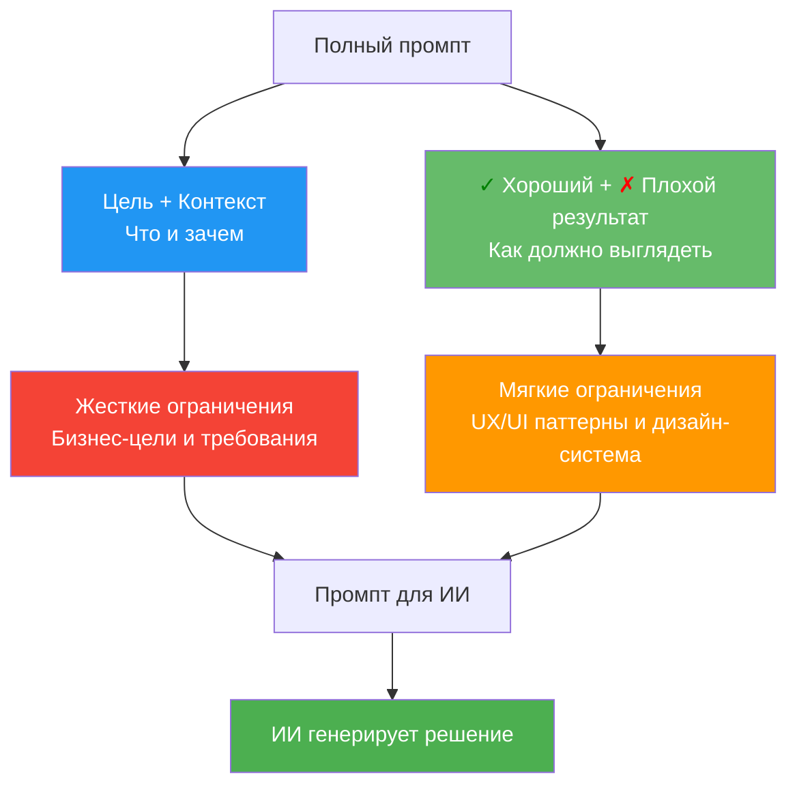

# Руководство для UX/UI дизайнеров: Работа с промптами

> **Для кого:** UX/UI дизайнеры  
> **Цель:** Научиться создавать эффективные структурированные промпты для работы с ИИ

## Работа с промптами: Структура для UX/UI дизайнера

### Как структурировать промпт

Структура промпта естественно делится на две части:



### Шаблон промпта для UX/UI дизайнера

**Ваша задача:** Создать полный структурированный промпт, который включает **ЧТО** нужно сделать, **В КАКОМ КОНТЕКСТЕ**, и **КАК** это должно выглядеть с точки зрения UX/UI.

**Шаблон:**

**Цель:**
[Что нужно достичь с точки зрения бизнеса/пользователя. Без упоминания конкретных UI-элементов]

**Контекст:**
- [Бизнес-контекст: какие метрики важны, какие проблемы решаем]
- [Пользовательский контекст: кто пользователь, какие у него потребности]
- [Технический контекст: ограничения платформы, существующие системы]
- [Данные: какие данные доступны, какие инсайты есть]

**<span style="color: green;">✓</span> Хороший результат:**
- [Примеры хороших UX-решений из дизайн-системы]
- [Паттерны, которые работают в нашем продукте]
- [Принципы, которым нужно следовать]

**<span style="color: red;">✗</span> Плохой результат:**
- [Примеры плохих UX-решений, которых нужно избегать]
- [Антипаттерны]
- [Типичные ошибки]

## Примеры промптов

### Пример <span style="color: green;">✓</span> хорошего промпта:

**Цель:**
Инженеры не понимают, почему устройство перешло в статус "Ошибка". Нужно повысить прозрачность диагностики состояния оборудования.

**Контекст:**
- Бизнес: снижение времени диагностики сбоев на 40%, уменьшение простоев оборудования
- Пользователь: инженеры-сервисники, которые обслуживают программно-аппаратные комплексы
- Технический: есть API для получения статусов устройств, данные обновляются в реальном времени через MQTT
- Данные: есть история статусов, коды ошибок, метрики производительности, временные метки событий

**<span style="color: green;">✓</span> Хороший результат:**
- Использовать компонент StatusTimeline из дизайн-системы для истории состояний
- Показывать код ошибки и описание сразу в карточке устройства (не скрывать в модальном окне)
- Использовать информационные иконки для объяснения технических терминов (например, "Температура превышена")
- Следовать паттерну "Progressive Disclosure": сначала краткая информация (статус, последняя ошибка), затем детали по запросу (полный лог, метрики)
- Использовать цветовую кодировку статусов из дизайн-системы (зеленый = работает, красный = ошибка, желтый = предупреждение)

**<span style="color: red;">✗</span> Плохой результат:**
- Скрывать важную информацию о сбоях в модальных окнах
- Использовать технические коды ошибок без объяснений
- Показывать все данные сразу без группировки
- Нарушать цветовую схему дизайн-системы
- Создавать новые компоненты вместо использования существующих

### Пример <span style="color: red;">✗</span> плохого промпта (с конкретными UI-решениями в Цели/Контексте):

**Цель:**
Сделать страницу со статусом устройства с таймлайном и модальным окном с деталями ошибки.

**Контекст:**
- Нужна кнопка "Подробнее" справа вверху
- Таймлайн должен быть вертикальным
- Модальное окно должно открываться по клику

**Почему это плохо:**
Когда вы описываете конкретные UI-решения в Цели и Контексте, это создает **индуктивный bias** для ИИ. ИИ видит конкретное решение и невольно начинает его реализовывать вместо того, чтобы найти оптимальное решение с точки зрения UX/UI и дизайн-системы.

### Практический пример полного промпта

**Цель:**
Инженеры не могут быстро найти нужное устройство среди 200+ единиц оборудования. Нужно улучшить навигацию по устройствам.

**Контекст:**
- Бизнес: инженеры тратят в среднем 4 минуты на поиск конкретного устройства
- Пользователь: инженеры-сервисники, которые обслуживают программно-аппаратные комплексы ежедневно
- Технический: устройства организованы в иерархическую структуру (локации → зоны → устройства)
- Данные: есть данные о статусах устройств, частоте обращения, поисковых запросах по серийным номерам

**<span style="color: green;">✓</span> Хороший результат:**
- Использовать компонент SearchWithFilters из дизайн-системы
- Показывать устройства с ошибками в отдельной секции "Требуют внимания"
- Использовать паттерн "Recent Items" для быстрого доступа к недавно просмотренным устройствам
- Группировать по локациям и зонам с иконками из дизайн-системы
- Использовать автодополнение в поиске по серийным номерам с подсветкой совпадений

**<span style="color: red;">✗</span> Плохой результат:**
- Простой список из 200+ элементов без группировки
- Поиск без автодополнения
- Отсутствие истории недавно просмотренных устройств
- Нарушение иерархии навигации дизайн-системы
- Создание нового компонента поиска вместо использования существующего

**Результат:**
ИИ получает полный промпт и генерирует решение, которое:
- Соответствует бизнес-целям
- Следует UX/UI-паттернам
- Использует дизайн-систему

### Дополнительный пример: Конфигурация устройств

**Цель:**
Инженеры тратят много времени на настройку параметров устройств, часто допускают ошибки при вводе значений. Нужно упростить процесс конфигурации и снизить количество ошибок на 50%.

**Контекст:**
- Бизнес: снижение времени настройки устройств на 30%, уменьшение ошибок конфигурации на 50%
- Пользователь: инженеры-настройщики, которые конфигурируют программно-аппаратные комплексы
- Технический: есть API для получения и установки параметров, валидация на стороне сервера
- Данные: есть шаблоны конфигураций, история изменений, типичные ошибки ввода

**<span style="color: green;">✓</span> Хороший результат:**
- Использовать компонент FormWithValidation из дизайн-системы
- Показывать подсказки и допустимые диапазоны значений прямо в полях ввода
- Использовать шаблоны конфигураций для быстрого применения стандартных настроек
- Показывать предупреждения при вводе значений вне рекомендуемого диапазона
- Использовать группировку параметров по категориям (Сеть, Безопасность, Производительность)
- Показывать состояние сохранения с подтверждением успешного применения

**<span style="color: red;">✗</span> Плохой результат:**
- Показывать все параметры одним длинным списком без группировки
- Отсутствие подсказок и валидации при вводе
- Нет возможности использовать шаблоны конфигураций
- Технические сообщения об ошибках без объяснений
- Нет обратной связи при сохранении конфигурации

## Вайбкодинг: Генерация интерактивных прототипов (Vibecoding)

Вайбкодинг (Vibecoding) — это процесс быстрой генерации рабочего кода (HTML/JS/React) с помощью ИИ для проверки UX-гипотез. Это позволяет "почувствовать" интерфейс до передачи в разработку.

### Зачем дизайнеру код?
1. **Проверка сложных взаимодействий:** Анимации, переходы, drag-n-drop сложно показать на статических макетах.
2. **Коридорные тесты:** Дать пользователю (или коллеге) "потыкать" живой интерфейс.
3. **Tech Review:** Показать разработчику не картинку, а работающий пример логики.

### Промпты для вайбкодинга

**Шаблон:**
```
Я хочу создать интерактивный прототип для [Задача].
Используй [Технологии: HTML/Tailwind/Vanilla JS или React/Mantine].
Цель: Проверить сценарий [Сценарий].
Важно реализовать:
- [Анимация/Логика 1]
- [Состояние ошибки]
- [Адаптивность]
Не трать время на точную стилизацию цветов, используй стандартные классы, главное — логика и расположение.
```

**Пример (React + Tailwind):**
```
Создай React компонент "StatusTimeline".
Данные: массив событий {date, status, description}.
Логика:
- По умолчанию свернуто, видно только последнее событие.
- При клике "Показать историю" список разворачивается с анимацией.
- Статус "Ошибка" должен быть красным и иметь иконку.
Используй Tailwind CSS для стилей. Сделай моковые данные для теста.
```

---

## Работа с Edge Cases и Состояниями

Хороший дизайн отличается от плохого проработкой граничных случаев. ИИ часто генерирует "идеальный путь" (Happy Path). Ваша задача — заставить его подумать об ошибках.

**Чек-лист состояний (States):**
- **Loading:** Как выглядит экран при загрузке? (Скелетоны, спиннеры).
- **Empty:** Что если данных нет? (Пустой список, первый запуск).
- **Error:** Что если API упал или нет интернета?
- **Partial Data:** Что если у пользователя нет аватарки или имени?

**Промпт для генерации состояний:**
```
Теперь создай варианты этого же экрана для следующих состояний:
1. Загрузка данных (используй Skeleton loader).
2. Ошибка загрузки (покажи кнопку "Повторить" и текст ошибки).
3. Пустой список (покажи иллюстрацию и кнопку "Создать").
4. Очень длинный заголовок (проверь перенос текста и обрезку).
```

---

## Definition of Done (Критерии готовности)

Перед тем как сказать "Готово", убедитесь, что макет содержит не только "красивую картинку".

**Минимальный набор:**
1. **Макеты:** Основной сценарий (Happy Path).
2. **Состояния:** Error, Empty, Loading для каждого экрана.
3. **Адаптив:** Desktop (1440px) + Mobile (375px) или Tablet (если нужно).
4. **Vibecode:** Ссылка на рабочий прототип (HTML файл или песочница) для сложных флоу.
5. **Tech Review:** Подтверждение от Lead Dev, что это реализуемо.

---

## Чек-лист для UX/UI дизайнера

Перед отправкой промпта и макетов проверьте:

- [ ] **Цель:** Я описал проблему без упоминания конкретных UI-элементов.
- [ ] **Контекст:** Я учел данные, бизнес-цели и технические ограничения.
- [ ] **Vibecode:** Я создал интерактивный прототип для проверки сложных сценариев.
- [ ] **Edge Cases:** Я отрисовал состояния Loading, Error, Empty, Partial Data.
- [ ] **Tech Review:** Я обсудил реализуемость решения с разработчиком.
- [ ] **Дизайн-система:** Я использовал существующие компоненты и цвета.
- [ ] **Антипаттерны:** Я явно указал, чего делать НЕЛЬЗЯ.

## Использование правил в промптах

Когда у вас есть правила в `.cursor/rules/`, ссылайтесь на них в промпте:

**Пример промпта с правилами:**

```
**Цель:**
Создать страницу со списком устройств с возможностью поиска и фильтрации.

**Контекст:**
- Пользователь: инженеры-сервисники, которые обслуживают устройства ежедневно
- Бизнес: инженеры тратят в среднем 4 минуты на поиск устройства среди 200+ вариантов
- Данные: может быть 200+ устройств, есть данные о статусах, локациях и частоте обращения

**Правила:**
- Используй компоненты из дизайн-системы (`.cursor/rules/design-system.mdc` → Компоненты)
- Используй `SearchWithFilters` для поиска (`.cursor/rules/design-system.mdc` → Компоненты)
- Используй пагинацию для списков >50 элементов (`.cursor/rules/ux-constraints.mdc` → Лимиты отображения данных)
- Следуй принципу Progressive Disclosure (`.cursor/rules/design-system.mdc` → Паттерны UX)
- Показывай состояние загрузки правильно (`.cursor/rules/platform-constraints.mdc` → Загрузка контента)

**✓ Хороший результат:**
- Использовать компонент `SearchWithFilters` из дизайн-системы
- Использовать `DataTable` с пагинацией (20 элементов на страницу) для списка устройств
- Показывать краткую информацию в карточке (название, статус, локация), детали — по клику
- Использовать цвета статусов из дизайн-системы (зеленый для работающих, красный для ошибок, желтый для предупреждений)
- Показывать скелетон таблицы при загрузке данных
- Группировать устройства по локациям (Цех 1, Цех 2, Склад)

**✗ Плохой результат:**
- Создавать новый компонент поиска вместо `SearchWithFilters`
- Показывать все 200+ устройств сразу без пагинации или группировки
- Показывать все данные сразу без возможности скрыть детали
- Использовать произвольные цвета вместо цветов из дизайн-системы
- Показывать спиннер на весь экран при загрузке вместо скелетона
- Не группировать устройства, показывать плоским списком
```

## Создание правил для проекта

Если вы часто используете одни и те же требования, создайте правила в `.cursor/rules/`. Это поможет:
- Не повторять одни и те же требования в каждом промпте
- Обеспечить единообразие решений
- Ускорить работу с ИИ

**См. подробнее:** [Справочник правил для ИИ](04-справочник-правил-для-ии.md) → раздел "Обучение: Как создавать правила для UX/UI дизайнера"

---

**См. также:**
- [Основы промптинга](01-основы-промптинга.md) — теоретические основания
- [Руководство для аналитиков и ПО](03-руководство-для-аналитиков-и-по.md) — как правильно взаимодействовать с дизайнерами
- [Справочник правил для ИИ](04-справочник-правил-для-ии.md) — создание и использование правил
