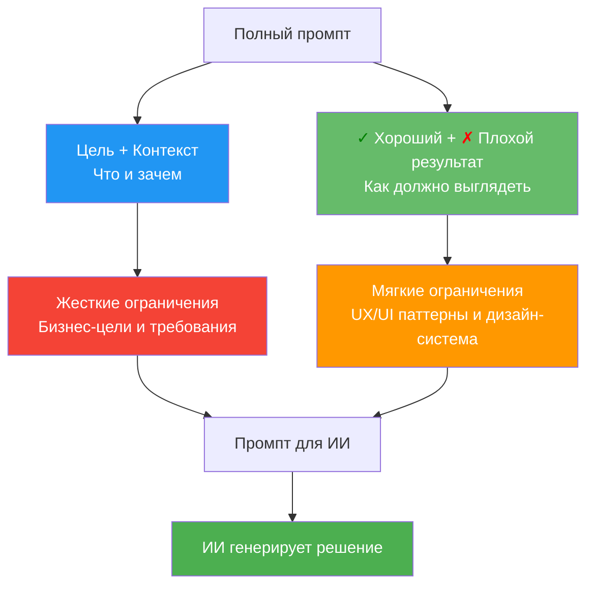

# Руководство для UX/UI дизайнеров: Работа с промптами

> **Для кого:** UX/UI дизайнеры  
> **Цель:** Научиться создавать эффективные структурированные промпты для работы с ИИ

## Работа с промптами: Структура для UX/UI дизайнера

### Как структурировать промпт

Структура промпта естественно делится на две части:



### Шаблон промпта для UX/UI дизайнера

**Ваша задача:** Создать полный структурированный промпт, который включает **ЧТО** нужно сделать, **В КАКОМ КОНТЕКСТЕ**, и **КАК** это должно выглядеть с точки зрения UX/UI.

**Шаблон:**

**Цель:**
[Что нужно достичь с точки зрения бизнеса/пользователя. Без упоминания конкретных UI-элементов]

**Контекст:**
- [Бизнес-контекст: какие метрики важны, какие проблемы решаем]
- [Пользовательский контекст: кто пользователь, какие у него потребности]
- [Технический контекст: ограничения платформы, существующие системы]
- [Данные: какие данные доступны, какие инсайты есть]

**<span style="color: green;">✓</span> Хороший результат:**
- [Примеры хороших UX-решений из дизайн-системы]
- [Паттерны, которые работают в нашем продукте]
- [Принципы, которым нужно следовать]

**<span style="color: red;">✗</span> Плохой результат:**
- [Примеры плохих UX-решений, которых нужно избегать]
- [Антипаттерны]
- [Типичные ошибки]

## Примеры промптов

### Пример <span style="color: green;">✓</span> хорошего промпта:

**Цель:**
Пользователи не понимают, почему их заявка была отклонена. Нужно повысить прозрачность процесса рассмотрения заявок.

**Контекст:**
- Бизнес: снижение количества обращений в поддержку на 30%
- Пользователь: заемщики, которые подают заявку на кредит
- Технический: есть API для получения статусов заявки, данные обновляются раз в час
- Данные: есть история статусов, причины отклонения, временные метки

**<span style="color: green;">✓</span> Хороший результат:**
- Использовать компонент StatusTimeline из дизайн-системы
- Показывать причину отклонения сразу в карточке статуса (не скрывать в модальном окне)
- Использовать информационные иконки для объяснения терминов
- Следовать паттерну "Progressive Disclosure": сначала краткая информация, затем детали по запросу
- Использовать цветовую кодировку статусов из дизайн-системы (зеленый = одобрено, красный = отклонено)

**<span style="color: red;">✗</span> Плохой результат:**
- Скрывать важную информацию в модальных окнах
- Использовать технические термины без объяснений
- Показывать все данные сразу без группировки
- Нарушать цветовую схему дизайн-системы
- Создавать новые компоненты вместо использования существующих

### Пример <span style="color: red;">✗</span> плохого промпта (с конкретными UI-решениями в Цели/Контексте):

**Цель:**
Сделать страницу со статусом заявки с таймлайном и модальным окном с деталями.

**Контекст:**
- Нужна кнопка "Подробнее" справа вверху
- Таймлайн должен быть вертикальным
- Модальное окно должно открываться по клику

**Почему это плохо:**
Когда вы описываете конкретные UI-решения в Цели и Контексте, это создает **индуктивный bias** для ИИ. ИИ видит конкретное решение и невольно начинает его реализовывать вместо того, чтобы найти оптимальное решение с точки зрения UX/UI и дизайн-системы.

### Практический пример полного промпта

**Цель:**
Пользователи не могут быстро найти нужный отчет среди 50+ вариантов. Нужно улучшить навигацию по отчетам.

**Контекст:**
- Бизнес: пользователи тратят в среднем 3 минуты на поиск отчета
- Пользователь: аналитики, которые используют отчеты ежедневно
- Технический: отчеты хранятся в иерархической структуре (категории → подкатегории → отчеты)
- Данные: есть данные о популярности отчетов, частоте использования, поисковых запросах

**<span style="color: green;">✓</span> Хороший результат:**
- Использовать компонент SearchWithFilters из дизайн-системы
- Показывать популярные отчеты в отдельной секции "Часто используемые"
- Использовать паттерн "Recent Items" для быстрого доступа
- Группировать по категориям с иконками из дизайн-системы
- Использовать автодополнение в поиске с подсветкой совпадений

**<span style="color: red;">✗</span> Плохой результат:**
- Простой список из 50+ элементов без группировки
- Поиск без автодополнения
- Отсутствие истории недавних отчетов
- Нарушение иерархии навигации дизайн-системы
- Создание нового компонента поиска вместо использования существующего

**Результат:**
ИИ получает полный промпт и генерирует решение, которое:
- Соответствует бизнес-целям
- Следует UX/UI-паттернам
- Использует дизайн-систему

## Чек-лист для UX/UI дизайнера

Перед отправкой промпта проверьте:

- [ ] Я описал Цель без упоминания конкретных UI-элементов (фокус на бизнес-целях и проблемах пользователя)
- [ ] Я описал Контекст (бизнес, пользователь, технический, данные)
- [ ] Я НЕ упомянул конкретные UI-элементы в Цели/Контексте (кнопки, модальные окна, таблицы)
- [ ] Я НЕ описал визуальные решения в Цели/Контексте (цвета, размеры, расположение)
- [ ] Я добавил примеры <span style="color: green;">✓</span> хороших UX/UI-решений из дизайн-системы
- [ ] Я описал антипаттерны, которых нужно избегать
- [ ] Я использовал существующие компоненты дизайн-системы
- [ ] Я учел принципы UX (Progressive Disclosure, Feedback, Consistency)

## Использование правил в промптах

Когда у вас есть правила в `.cursor/rules/`, ссылайтесь на них в промпте:

**Пример промпта с правилами:**

```
**Цель:**
Создать страницу со списком отчетов с возможностью поиска и фильтрации.

**Контекст:**
- Пользователь: аналитики, которые используют отчеты ежедневно
- Бизнес: пользователи тратят в среднем 3 минуты на поиск отчета среди 100+ вариантов
- Данные: может быть 100+ отчетов, есть данные о популярности и частоте использования

**Правила:**
- Используй компоненты из дизайн-системы (`.cursor/rules/design-system.mdc` → Компоненты)
- Используй `SearchWithFilters` для поиска (`.cursor/rules/design-system.mdc` → Компоненты)
- Используй пагинацию для списков >50 элементов (`.cursor/rules/ux-constraints.mdc` → Лимиты отображения данных)
- Следуй принципу Progressive Disclosure (`.cursor/rules/design-system.mdc` → Паттерны UX)
- Показывай состояние загрузки правильно (`.cursor/rules/platform-constraints.mdc` → Загрузка контента)

**✓ Хороший результат:**
- Использовать компонент `SearchWithFilters` из дизайн-системы
- Использовать `DataTable` с пагинацией (20 элементов на страницу) для списка отчетов
- Показывать краткую информацию в карточке (название, дата, статус), детали — по клику
- Использовать цвета статусов из дизайн-системы (зеленый для активных, серый для архивных)
- Показывать скелетон таблицы при загрузке данных
- Группировать отчеты по категориям (Финансы, Маркетинг, Продажи)

**✗ Плохой результат:**
- Создавать новый компонент поиска вместо `SearchWithFilters`
- Показывать все 100+ отчетов сразу без пагинации или группировки
- Показывать все данные сразу без возможности скрыть детали
- Использовать произвольные цвета вместо цветов из дизайн-системы
- Показывать спиннер на весь экран при загрузке вместо скелетона
- Не группировать отчеты, показывать плоским списком
```

## Создание правил для проекта

Если вы часто используете одни и те же требования, создайте правила в `.cursor/rules/`. Это поможет:
- Не повторять одни и те же требования в каждом промпте
- Обеспечить единообразие решений
- Ускорить работу с ИИ

**См. подробнее:** [Справочник правил для ИИ](04-справочник-правил-для-ии.md) → раздел "Обучение: Как создавать правила для UX/UI дизайнера"

---

**См. также:**
- [Основы промптинга](01-основы-промптинга.md) — теоретические основания
- [Руководство для аналитиков и ПО](03-руководство-для-аналитиков-и-по.md) — как правильно взаимодействовать с дизайнерами
- [Справочник правил для ИИ](04-справочник-правил-для-ии.md) — создание и использование правил
