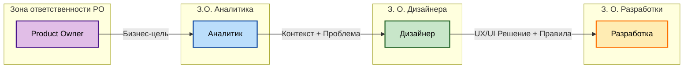
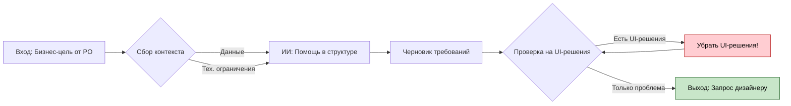
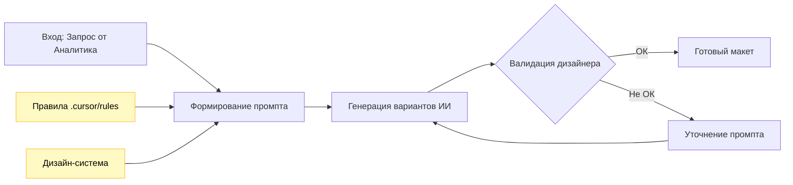
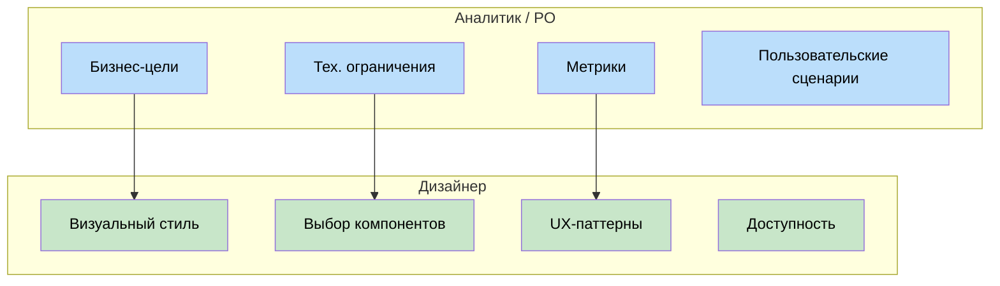

# Процесс работы команды: От идеи до разработки

> **Цель:** Описать пошаговый процесс работы над задачами, четко разделив зоны ответственности и показав точки взаимодействия между ролями.

## Введение

В нашей команде (3 дизайнера на 6 проектов) критически важно соблюдать четкий процесс, чтобы избежать "узких горлышек" и размытия ответственности. Этот документ объединяет принципы из [руководства для аналитиков](03-руководство-для-аналитиков-и-по.md) и [руководства для дизайнеров](02-руководство-для-дизайнеров.md) в единый поток.

### Участники процесса
- **Product Owner (PO):** Определяет "Зачем" и "Что" (бизнес-цели).
- **Аналитик:** Детализирует "Что" и "В каком контексте" (требования, данные).
- **Дизайнер:** Определяет "Как" (UX/UI решение).
- **Разработчик:** Реализует решение.

---

## Общая схема процесса

---

## Пошаговое описание

### Этап 1: Product Owner (PO)
**Фокус:** Бизнес-ценность и метрики.

PO инициирует задачу. На этом этапе не обсуждаются кнопки или экраны. Обсуждаются проблемы бизнеса или пользователей.

1. **Формулирует гипотезу/проблему.**
2. **Определяет метрики успеха** (например, снижение обращений в поддержку на 30%).
3. **Приоритизирует задачу.**

---

### Этап 2: Аналитик
**Фокус:** Контекст и ограничения.

Аналитик превращает бизнес-хотелки в структурированный запрос.

**Действия:**
1. **Сбор контекста:**
   - Кто пользователь?
   - Какие технические ограничения (API, легаси)?
   - Какие данные доступны?
2. **Формирование запроса дизайнеру:**
   - *Используйте ИИ для структурирования, но не для решений.*
   - Формат: Проблема + Контекст + Ограничения.
   - **ЗАПРЕЩЕНО:** Предлагать конкретные UI-решения (кнопки, модалки).

**Схема работы аналитика:**

---

### Этап 3: Дизайнер
**Фокус:** UX/UI решение и Дизайн-система.

Дизайнер получает проблему и находит лучшее визуальное и интерактивное решение.

**Действия:**
1. **Анализ запроса:** Понимание проблемы пользователя.
2. **Работа с ИИ:**
   - Составление структурированного промпта (Цель -> Контекст -> Хороший/Плохой пример).
   - Подключение правил (`.cursor/rules/`).
3. **Генерация и доработка:** Создание макетов, прототипов.
4. **Валидация:** Проверка на соответствие дизайн-системе.

**Схема работы дизайнера:**

---

### Этап 4: Согласование
**Фокус:** Соответствие бизнес-цели.

Встреча PO, Аналитика и Дизайнера.

- **Аналитик/PO проверяют:** Решает ли дизайн проблему бизнеса? Учтены ли технические ограничения?
- **Дизайнер защищает:** Почему выбрано такое решение (UX паттерны, исследования).
- **ВАЖНО:** Не обсуждаем "нравится/не нравится цвет", если он из дизайн-системы.

---

### Этап 5: Разработка
**Фокус:** Реализация.

Дизайнер передает макеты и правила разработчикам.

1. **Передача макетов.**
2. **Передача правил для ИИ:** Разработчики могут использовать те же `.mdc` файлы правил для генерации кода компонентов, чтобы ИИ-копайлот соблюдал дизайн-систему.

---

## Границы ответственности

## Чек-листы готовности

### Для Аналитика (перед передачей Дизайнеру)
- [ ] Описана проблема, а не решение.
- [ ] Указаны метрики успеха.
- [ ] Описан контекст (кто, где, когда).
- [ ] **Нет** требований по цвету кнопок или расположению элементов (если это не критично для бизнеса).

### Для Дизайнера (перед передачей в Разработку)
- [ ] Решение решает заявленную проблему.
- [ ] Использованы компоненты дизайн-системы.
- [ ] Учтены состояния ошибок, загрузки, пустые экраны.
- [ ] Проверена доступность.

---

**Далее:**
- [Вернуться к содержанию](00-содержание.md)

