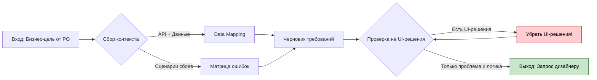
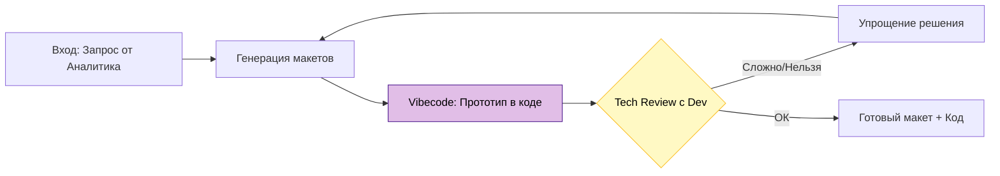

# Процесс работы команды: От идеи до разработки

> **Цель:** Описать пошаговый процесс работы над задачами, четко разделив зоны ответственности и показав точки взаимодействия между ролями.

## Введение

В нашей команде (3 дизайнера на 6 проектов) критически важно соблюдать четкий процесс, чтобы избежать "узких горлышек" и размытия ответственности. Этот документ объединяет принципы из [руководства для аналитиков](03-руководство-для-аналитиков-и-по.md) и [руководства для дизайнеров](02-руководство-для-дизайнеров.md) в единый поток.

### Участники процесса
- **Product Owner (PO):** Определяет "Зачем" и "Что" (бизнес-цели).
- **Аналитик:** Детализирует "Что" и "В каком контексте" (требования, данные, бизнес-логика).
- **Дизайнер:** Определяет "Как" (UX/UI решение, прототип).
- **Разработчик:** Реализует решение (участвует в раннем ревью).

---

## Определения: Два типа сценариев

Чтобы избежать путаницы, мы разделяем сценарии на два уровня:

| Тип сценария | User Story (Функциональный) | Interaction Flow (Интерфейсный) |
|---|---|---|
| **Ответственный** | **Аналитик / PO** | **UX Дизайнер** |
| **Определение** | Описание того, **ЧТО** пользователь хочет сделать и **ЗАЧЕМ**. Это формулировка потребности бизнеса или пользователя без привязки к интерфейсу. | Описание того, **КАК** пользователь взаимодействует с системой, чтобы достичь цели. Это последовательность экранов, кликов, состояний и интерактивный прототип. |
| **Пример** | "Пользователь хочет узнать причину сбоя устройства, чтобы понять, что исправить." | "Пользователь видит статус 'Ошибка' (красный). При клике открывается панель с деталями ошибки и кнопкой 'Диагностика'." |
| **Цель** | Зафиксировать бизнес-требование и логику данных. | Создать удобный интерфейс и проверить его в коде. |

---

## Общая схема процесса

```mermaid
graph LR
    PO[Product Owner] -->|Бизнес-цель| AN[Аналитик]
    AN -->|Контекст + Данные + Ошибки| DES[Дизайнер]
    DES -->|Прототип (Vibecode)| TR{Tech Review}
    TR -->|ОК| APPROVE{Согласование}
    TR -->|Невозможно| DES
    APPROVE -->|Макеты + Код-референс| DEV[Разработка]
    
    subgraph "Зона ответственности PO"
    PO
    end
    
    subgraph "Зона ответственности Аналитика"
    AN
    end
    
    subgraph "Зона ответственности Дизайнера"
    DES
    TR
    end
    
    subgraph "Зона ответственности Разработки"
    DEV
    end
    
    style PO fill:#E1BEE7,stroke:#4A148C,stroke-width:2px,color:#000000
    style AN fill:#BBDEFB,stroke:#0D47A1,stroke-width:2px,color:#000000
    style DES fill:#C8E6C9,stroke:#1B5E20,stroke-width:2px,color:#000000
    style TR fill:#FFF9C4,stroke:#FBC02D,stroke-width:2px,color:#000000
    style DEV fill:#FFECB3,stroke:#FF6F00,stroke-width:2px,color:#000000
```

---

## Пошаговое описание

### Этап 1: Product Owner (PO)
**Фокус:** Бизнес-ценность и метрики.

PO инициирует задачу. На этом этапе не обсуждаются кнопки или экраны. Обсуждаются проблемы бизнеса или пользователей.

1. **Формулирует гипотезу/проблему.**
2. **Определяет метрики успеха** (например, снижение обращений в поддержку на 30%).
3. **Приоритизирует задачу.**

---

### Этап 2: Аналитик
**Фокус:** Контекст, данные и бизнес-логика.

Аналитик превращает бизнес-хотелки в структурированный запрос.

**Действия:**
1. **Сбор контекста:**
   - Кто пользователь?
   - Какие технические ограничения (API, легаси)?
2. **Data Mapping (Маппинг данных):**
   - Четкое описание полей: `Название поля (API)` -> `Формат` -> `Пример значения`.
   - Откуда берутся данные (реальное время, кэш, исторические)?
3. **Матрица ошибок (Бизнес-логика):**
   - Какие ошибки могут возникнуть? (Нет прав, нет данных, таймаут, конфликт).
   - Что делать пользователю в каждом случае? (Текст ошибки, кнопка "Повторить", звонок в поддержку).
4. **Формирование запроса дизайнеру:**
   - Формат: Проблема + Контекст + Данные + Матрица ошибок.
   - **ЗАПРЕЩЕНО:** Предлагать конкретные UI-решения.

**Схема работы аналитика:**



#### Спец-сценарий: Изменение существующего интерфейса

Это частая ловушка bias (предвзятости). Старый интерфейс "якорит" мышление, и аналитик часто пытается просто "передвинуть кнопку".

**Принципы работы с редизайном:**
1. **Фокус на проблеме текущего решения**, а не на новом дизайне.
2. **Техника "Скриншот с болями":** Сделайте скриншот текущего интерфейса и повесьте на него стикеры ТОЛЬКО с фактами/проблемами.

| Плохой запрос (Bias) | Хороший запрос (No Bias) |
|---|---|
| "Перекрась индикатор статуса в красный и сделай его крупнее." | "Инженеры не замечают устройства с ошибками при просмотре списка. 30% критичных сбоев обнаруживаются с задержкой." |
| "Сделай модальное окно вместо страницы для деталей ошибки." | "Инженеры теряют контекст при переходе на отдельную страницу, не видят связь между устройством и его ошибками." |

---

### Этап 3: Дизайнер
**Фокус:** UX/UI решение, Вайбкодинг и Техническая проверка.

Дизайнер получает проблему и находит лучшее визуальное и интерактивное решение, проверяя его в коде.

**Действия:**
1. **Анализ запроса:** Понимание проблемы, данных и сценариев ошибок.
2. **Работа с ИИ и Генерация:**
   - Составление промпта с учетом правил.
   - Создание макетов.
3. **Vibecoding / Прототипирование:**
   - Создание интерактивного HTML/JS/React прототипа с помощью ИИ.
   - Цель: проверить сложные сценарии (анимации, переходы, поведение при ошибках) "в руках".
4. **Tech Review (Техническое ревью):**
   - Показ прототипа/макетов разработчику (Lead Dev).
   - Вопрос: "Это реализуемо в разумные сроки? Данные позволяют это сделать?"
   - Если "Нет" -> Возврат к этапу генерации.
5. **Валидация:** Проверка на соответствие дизайн-системе и закрытие Edge Cases (длинные тексты, пустые состояния).

**Схема работы дизайнера:**



---

### Этап 4: Согласование
**Фокус:** Соответствие бизнес-цели и реальности.

Встреча PO, Аналитика и Дизайнера (и желательно Лид Разработчика).

- **Что смотрим:** Не только картинки, но и **интерактивный прототип**.
- **Аналитик/PO проверяют:** Решает ли дизайн проблему? Учтены ли все бизнес-кейсы ошибок?
- **Дизайнер защищает:** UX решения.
- **Разработчик подтверждает:** Техническую реализуемость.

---

### Этап 5: Разработка
**Фокус:** Реализация.

Дизайнер передает материалы разработчикам.

1. **Передача макетов (Figma).**
2. **Передача Reference Code (Vibecode):** Код прототипа передается как "живая спецификация" поведения. *Важно: Пометить, что это не продакшн-код, а референс логики UI.*
3. **Правила для ИИ:** `.mdc` файлы.

---

## Границы ответственности

```mermaid
graph TD
    subgraph "Аналитик / PO"
    A1[Бизнес-цели]
    A2[Data Mapping (Данные)]
    A3[Матрица ошибок (Логика)]
    A4["User Stories (ЧТО)"]
    end
    
    subgraph "Дизайнер"
    D1[Визуальный стиль]
    D2[Интерактивный прототип]
    D3["Interaction Flows (КАК)"]
    D4[Edge Cases (UI)]
    end
    
    A1 --> D1
    A2 --> D2
    A3 --> D4
    
    style A1 fill:#BBDEFB,color:#000000
    style A2 fill:#BBDEFB,color:#000000
    style A3 fill:#BBDEFB,color:#000000
    style A4 fill:#BBDEFB,color:#000000
    
    style D1 fill:#C8E6C9,color:#000000
    style D2 fill:#C8E6C9,color:#000000
    style D3 fill:#C8E6C9,color:#000000
    style D4 fill:#C8E6C9,color:#000000
```

## Чек-листы готовности

### Для Аналитика (перед передачей Дизайнеру)
- [ ] Описана проблема, а не решение.
- [ ] **Data Mapping:** Указаны конкретные поля данных и их форматы.
- [ ] **Матрица ошибок:** Описаны сценарии бизнес-ошибок и реакции системы.
- [ ] Описан контекст (кто, где, когда).
- [ ] **Нет** требований по цвету кнопок или расположению элементов.

### Для Дизайнера (перед передачей в Разработку)
- [ ] **Tech Review:** Решение согласовано с разработчиком (технически реализуемо).
- [ ] **Vibecode:** Создан интерактивный прототип для сложных сценариев.
- [ ] **Edge Cases:** Отрисованы длинные названия, пустые списки, состояния загрузки.
- [ ] Решение решает заявленную проблему.
- [ ] Использованы компоненты дизайн-системы.
- [ ] Проверена доступность.

---

**Далее:**
- [Вернуться к содержанию](00-содержание.md)
