# Структурированный промптинг для ИИ

## Введение

ИИ лучше всего воспринимает цепочку: **Цель → Контекст → <span style="color: green;">✓</span> Хороший результат → <span style="color: red;">✗</span> Плохой результат**. Эта структура значительно повышает качество ответов языковых моделей.

## Почему это работает

### Простое объяснение

Представьте, что вы просите друга помочь с задачей:

**<span style="color: red;">✗</span> Плохо:**
- "Помоги мне с проектом"

**<span style="color: green;">✓</span> Хорошо:**
- **Цель:** "Нужно улучшить пользовательский опыт работы с аналитическими отчетами"
- **Контекст:** "Пользователи-аналитики не могут быстро найти нужный отчет среди 50+ вариантов, тратят в среднем 3 минуты на поиск"
- **<span style="color: green;">✓</span> Хороший результат:** "Решение должно использовать компоненты из дизайн-системы, показывать популярные отчеты отдельно, иметь автодополнение в поиске"
- **<span style="color: red;">✗</span> Плохой результат:** "Не нужно создавать новый компонент поиска, не нужно показывать все 50+ отчетов списком без группировки"

Второй вариант понятнее, потому что он задает рамки и примеры.

### Научное объяснение

ИИ работает как очень быстрый помощник, который:
- Ищет паттерны в обучении
- Комбинирует их под задачу
- Без четких указаний может выбрать не тот паттерн

Структура **Цель → Контекст → <span style="color: green;">✓</span> Хорошо/<span style="color: red;">✗</span> Плохо** помогает:
- Сузить пространство вариантов
- Выбрать подходящие паттерны
- Избежать нежелательных решений

## Структура эффективного промпта

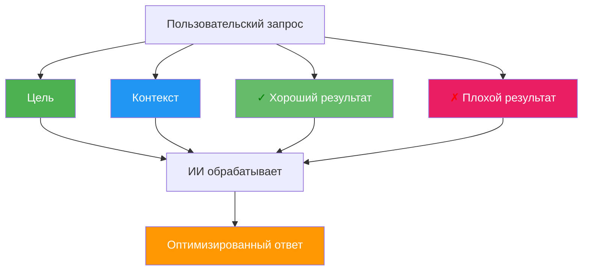

## Теоретические основания

### 1. Теория информации и энтропия

**Научное объяснение:**
Структурированный промпт снижает энтропию распределения вероятностей модели.

- Без структуры: модель опирается на априорное распределение P(y|x), где x — вход, y — выход. Энтропия H(Y|X) высока, что ведет к высокой неопределенности.
- Со структурой: добавление ограничений (goal, context, positive/negative examples) сужает гипотезное пространство и снижает условную энтропию H(Y|X, constraints).

Формульно: H(Y|X, G, C, E+) < H(Y|X), где G — цель, C — контекст, E+ — примеры.

**Простыми словами:**
Энтропия — это мера неопределенности. Чем больше вариантов ответа, тем выше энтропия. Структурированный промпт уменьшает количество возможных ответов, снижая неопределенность.

**Визуализация:**

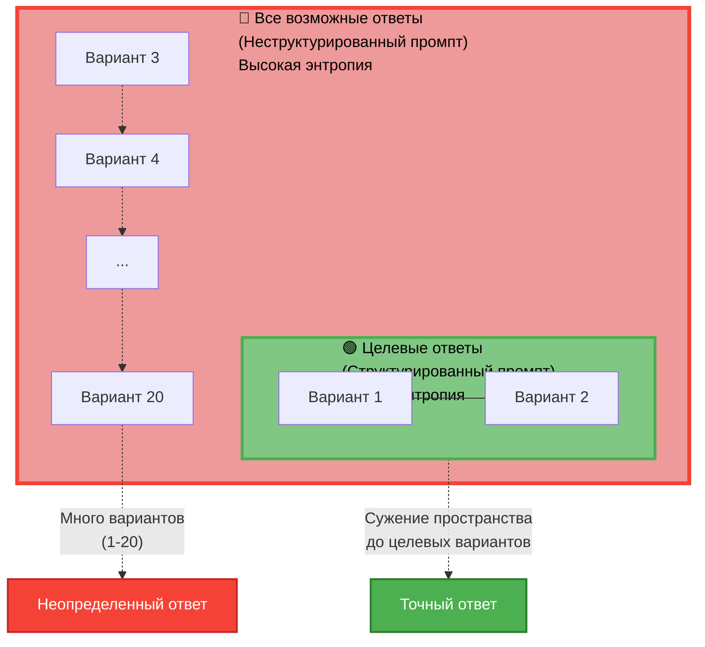

**Словарь терминов:**
- **Энтропия** — мера неопределенности/хаоса
- **Распределение вероятностей** — какие ответы модель считает более или менее вероятными
- **Априорное распределение** — то, что модель знает до вашего запроса
- **Условная энтропия** — неопределенность при заданных условиях
- **Гипотезное пространство** — все возможные варианты ответов

---

### 2. Принцип максимума энтропии и байесовский вывод

**Научное объяснение:**
Модель аппроксимирует байесовский вывод:

P(y|x) ∝ P(x|y) · P(y)

Структурированный промпт:
- Уточняет априор P(y) через цель и контекст
- Задает правдоподобие P(x|y) через примеры
- Снижает влияние нерелевантных паттернов из обучения

**Простыми словами:**
Модель оценивает вероятность ответа по формуле: вероятность ответа = (насколько ответ подходит под примеры) × (насколько ответ вероятен сам по себе). Структурированный промпт уточняет обе части формулы.

**Визуализация:**

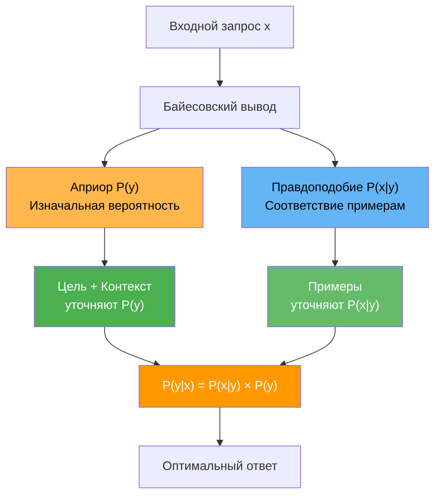

**Словарь терминов:**
- **Байесовский вывод** — способ оценки вероятности с учетом новой информации
- **Априор P(y)** — изначальная вероятность ответа
- **Правдоподобие P(x|y)** — насколько примеры подтверждают ответ
- **Паттерны** — повторяющиеся шаблоны в данных

---

### 3. Теория обучения с подсказками (Few-shot learning)

**Научное объяснение:**
Структура промпта реализует few-shot learning через in-context examples:

- Цель и контекст задают задачу
- Положительные примеры — демонстрации желаемого поведения
- Отрицательные примеры — контрастные примеры, сужающие гипотезное пространство

Механизм: модель использует attention для сопоставления входного запроса с примерами и генерации ответа по аналогии.

**Простыми словами:**
Модель учится на примерах прямо в запросе. Цель и контекст задают задачу, положительные примеры показывают как надо, отрицательные — как не надо. Модель сравнивает ваш запрос с примерами и отвечает по аналогии.

**Визуализация:**

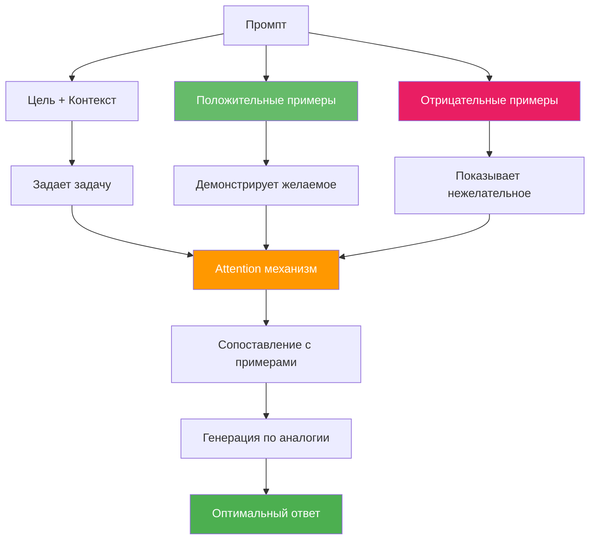

**Словарь терминов:**
- **Few-shot learning** — обучение на малом количестве примеров
- **In-context examples** — примеры, данные прямо в запросе
- **Attention** — механизм, который выделяет важные части входных данных
- **По аналогии** — используя похожие примеры

---

### 4. Когнитивная архитектура и активация релевантных паттернов

**Научное объяснение:**
В трансформерах:

- Цель активирует релевантные слои/головы внимания
- Контекст модулирует веса внимания
- Примеры создают шаблоны активации, которые модель воспроизводит

Формально: Attention(Q, K, V) = softmax(QK^T/√d_k)V, где структурированный промпт влияет на Q (query) и K (key), активируя нужные паттерны.

**Простыми словами:**
Модель состоит из слоев, которые активируются разными частями запроса. Цель включает нужные слои, контекст настраивает их работу, примеры задают шаблон активации. В итоге активируются нужные части модели.

**Визуализация:**

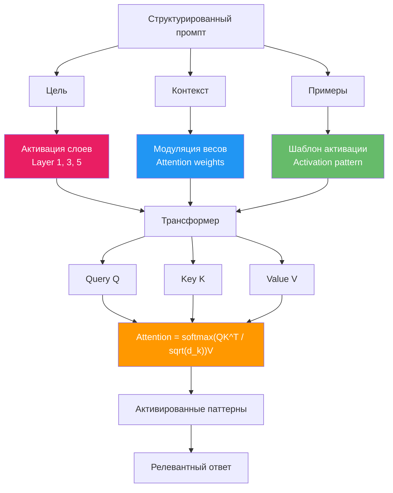

**Словарь терминов:**
- **Трансформер** — архитектура нейросети
- **Слои** — уровни обработки информации
- **Головы внимания** — части модели, которые выделяют важное
- **Веса внимания** — насколько сильно модель обращает внимание на разные части
- **Query (Q), Key (K), Value (V)** — компоненты механизма внимания
- **Softmax** — функция, превращающая числа в вероятности

---

### 5. Теория ограничений (Constraint Satisfaction)

**Научное объяснение:**
Структурированный промпт задает ограничения:

- Жесткие: цель и контекст (должны выполняться)
- Мягкие: примеры (предпочтительные паттерны)

Модель решает задачу удовлетворения ограничений, максимизируя вероятность при их соблюдении.

**Простыми словами:**
Промпт задает правила: цель и контекст — обязательные, примеры — желательные. Модель ищет ответ, который соблюдает обязательные правила и по возможности соответствует примерам.

**Визуализация:**

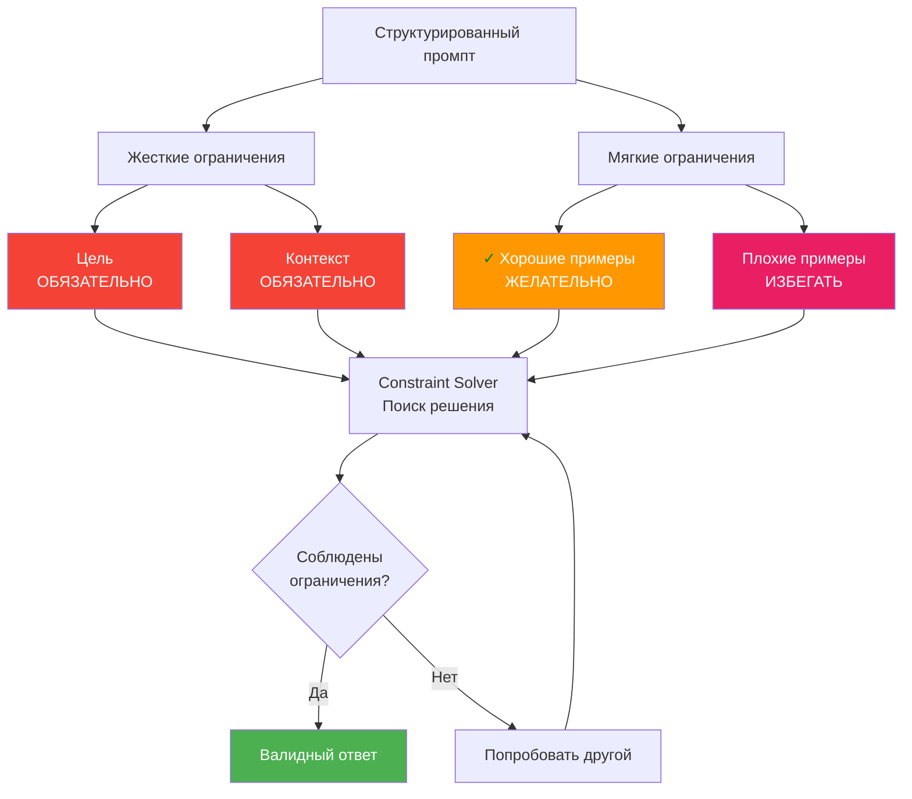

**Словарь терминов:**
- **Ограничения** — правила, которые нужно соблюдать
- **Жесткие ограничения** — обязательные правила
- **Мягкие ограничения** — желательные правила
- **Удовлетворение ограничений** — поиск решения, которое соблюдает правила

---

### 6. Индуктивный bias и обобщение

**Научное объяснение:**
Структура промпта вводит индуктивный bias:

- Цель задает целевую функцию
- Контекст — домен
- Примеры — гипотезное пространство

Это улучшает обобщение за счет сужения гипотезного пространства и снижения риска переобучения на нерелевантные паттерны.

**Простыми словами:**
Структура промпта задает предпочтения модели: цель — что искать, контекст — где искать, примеры — как искать. Это помогает модели лучше обобщать и не уходить в нерелевантные варианты.

**Визуализация:**

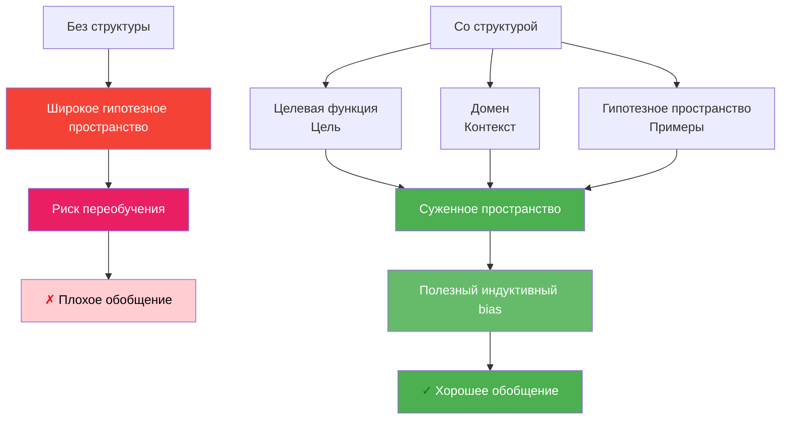

**Словарь терминов:**
- **Индуктивный bias** — предпочтения модели при обучении
- **Целевая функция** — что нужно максимизировать/минимизировать
- **Домен** — область применения (например, программирование, медицина)
- **Обобщение** — способность работать на новых данных
- **Переобучение** — когда модель запоминает детали вместо общих закономерностей

---

### 7. Теория оптимального контроля и регуляризация

**Научное объяснение:**
Структурированный промпт действует как регуляризатор:

- Цель — целевая функция
- Контекст — ограничения состояния
- Примеры — регуляризация через штраф за отклонение от желаемых паттернов

Формально: argmax_y [log P(y|x) + λ₁·R_goal(y) + λ₂·R_context(y) + λ₃·R_examples(y)]

**Простыми словами:**
Модель выбирает ответ, который одновременно вероятен и соответствует цели, контексту и примерам. Структура промпта добавляет штрафы за отклонение от желаемого, направляя выбор.

**Визуализация:**

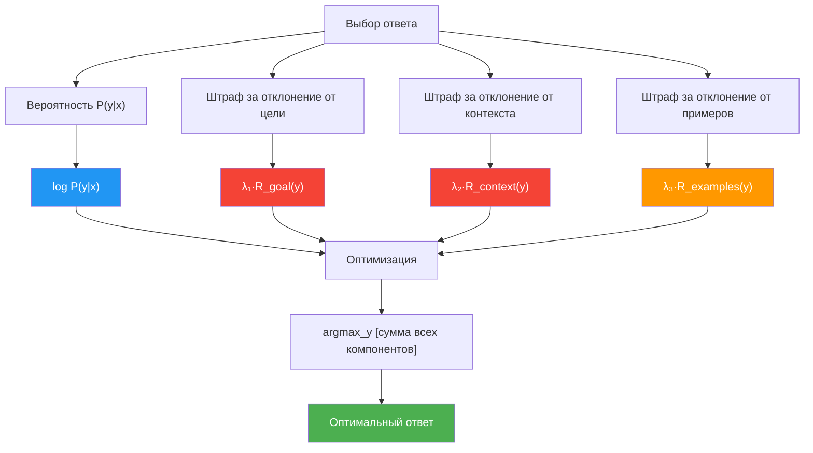

**Словарь терминов:**
- **Оптимальный контроль** — выбор наилучшего действия
- **Регуляризация** — способ ограничить модель, чтобы избежать переобучения
- **Штраф** — наказание за отклонение от желаемого
- **Argmax** — выбор варианта с максимальным значением
- **Lambda (λ)** — коэффициенты важности разных частей

---

### 8. Эмпирические подтверждения

**Научное объяснение:**
Исследования показывают:

- Chain-of-Thought: пошаговое рассуждение улучшает точность
- Few-shot prompting: примеры повышают производительность
- Negative prompting: отрицательные примеры снижают ошибки типа II

**Простыми словами:**
Эксперименты подтверждают: пошаговое рассуждение, примеры в запросе и отрицательные примеры улучшают результаты модели.

**Визуализация:**

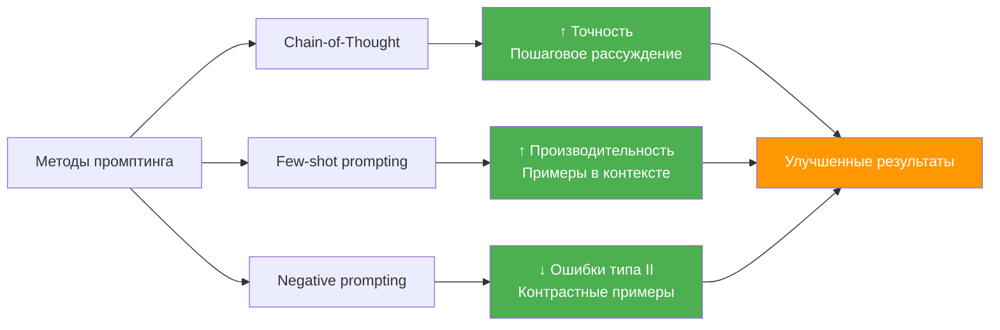

**Словарь терминов:**
- **Эмпирические** — основанные на опыте/экспериментах
- **Chain-of-Thought** — пошаговое рассуждение
- **Few-shot prompting** — запросы с примерами
- **Negative prompting** — запросы с отрицательными примерами
- **Ошибки типа II** — когда модель не находит то, что нужно найти

---

## Общая схема работы структурированного промпта

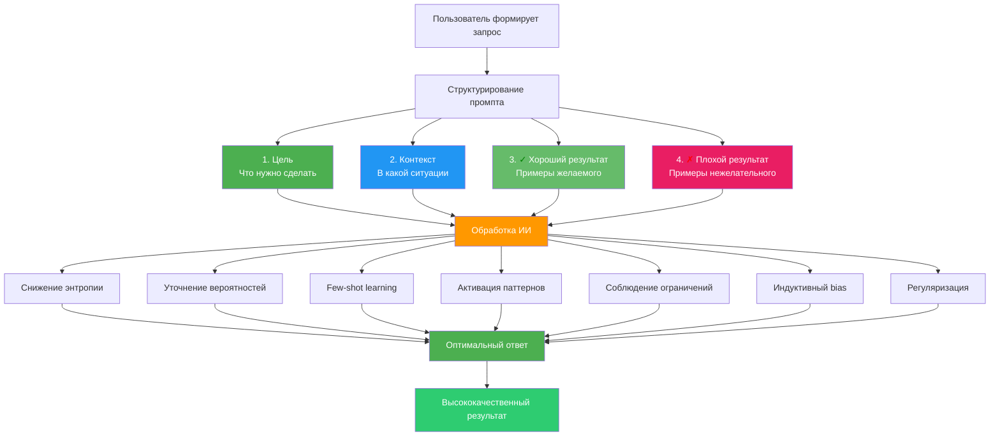

## Практический пример

### <span style="color: red;">✗</span> Плохой промпт:
```
Сделай дашборд для аналитики
```

### <span style="color: green;">✓</span> Хороший структурированный промпт:

**Цель:**
Пользователи не понимают, почему их заявка была отклонена. Нужно повысить прозрачность процесса рассмотрения заявок и снизить количество обращений в поддержку на 30%.

**Контекст:**
- Бизнес: снижение количества обращений в поддержку на 30%
- Пользователь: заемщики, которые подают заявку на кредит
- Технический: есть API для получения статусов заявки, данные обновляются раз в час
- Данные: есть история статусов, причины отклонения, временные метки

**<span style="color: green;">✓</span> Хороший результат:**
- Использовать компонент StatusTimeline из дизайн-системы
- Показывать причину отклонения сразу в карточке статуса (не скрывать в модальном окне)
- Использовать информационные иконки для объяснения терминов
- Следовать паттерну "Progressive Disclosure": сначала краткая информация, затем детали по запросу
- Использовать цветовую кодировку статусов из дизайн-системы (зеленый = одобрено, красный = отклонено)

**<span style="color: red;">✗</span> Плохой результат:**
- Скрывать важную информацию в модальных окнах
- Использовать технические термины без объяснений
- Показывать все данные сразу без группировки
- Нарушать цветовую схему дизайн-системы
- Создавать новые компоненты вместо использования существующих

## Разделение ролей: Аналитики и Дизайнеры

### Проблема

Когда аналитик создает полный промпт с UI-решениями, это создает **индуктивный bias** для дизайнера. Дизайнер видит конкретное UI-решение и невольно начинает его перерисовывать вместо того, чтобы найти оптимальное решение с точки зрения UX/UI и дизайн-системы.

**Почему это проблема:**
- Аналитик описывает **ЧТО** нужно сделать (цель) и **В КАКОМ КОНТЕКСТЕ** (контекст)
- Дизайнер знает **КАК** это должно выглядеть с точки зрения UX/UI (<span style="color: green;">✓</span> хороший/<span style="color: red;">✗</span> плохой результат)
- Когда аналитик показывает UI, он задает нежелательный паттерн активации для дизайнера

### Решение: Разделение ответственности

Структура промпта естественно делится на две части по ролям:

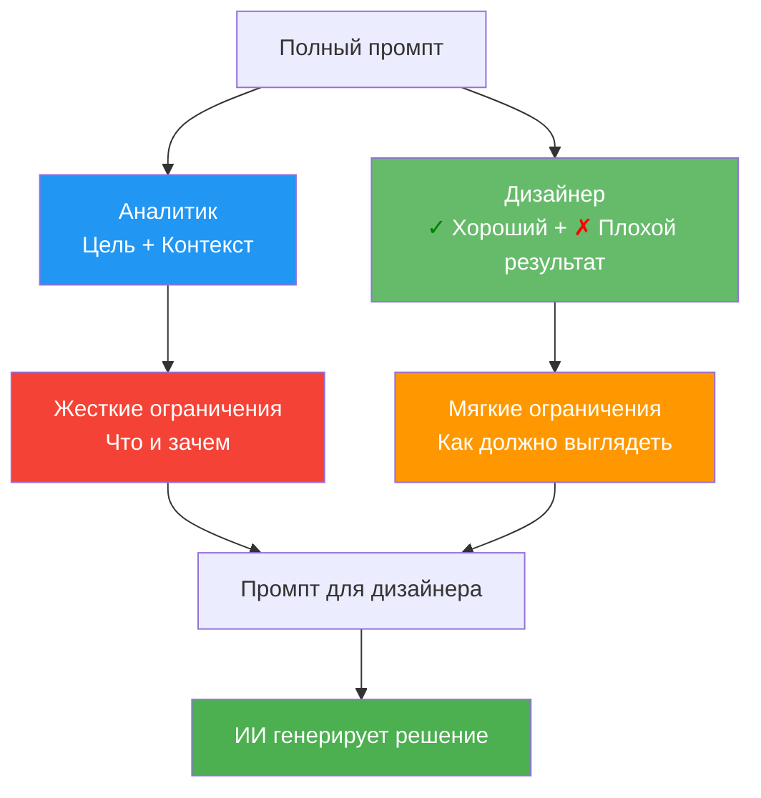

### Шаблон промпта для аналитика

**Ваша задача:** Описать **ЧТО** нужно сделать и **В КАКОМ КОНТЕКСТЕ**, **БЕЗ** конкретных UI-решений.

**Шаблон:**

**Цель:**
[Что нужно достичь с точки зрения бизнеса/пользователя. Без упоминания конкретных UI-элементов]

**Контекст:**
- [Бизнес-контекст: какие метрики важны, какие проблемы решаем]
- [Пользовательский контекст: кто пользователь, какие у него потребности]
- [Технический контекст: ограничения платформы, существующие системы]
- [Данные: какие данные доступны, какие инсайты есть]

**❌ Что НЕ включать:**
- Конкретные UI-элементы ("нужна кнопка", "таблица", "модальное окно")
- Визуальные решения ("красная кнопка", "большой шрифт")
- Расположение элементов ("слева", "вверху")

**✅ Что включать:**
- Функциональные требования ("нужно показать сравнение", "требуется фильтрация")
- Бизнес-логика ("приоритет важнее скорости", "нужна группировка по категориям")
- Ограничения ("нельзя показывать больше 10 элементов", "должна быть доступна офлайн")

**Пример <span style="color: green;">✓</span> хорошего промпта аналитика:**

**Цель:**
Пользователи не понимают, почему их заявка была отклонена. Нужно повысить прозрачность процесса рассмотрения заявок.

**Контекст:**
- Бизнес: снижение количества обращений в поддержку на 30%
- Пользователь: заемщики, которые подают заявку на кредит
- Технический: есть API для получения статусов заявки, данные обновляются раз в час
- Данные: есть история статусов, причины отклонения, временные метки

**Пример <span style="color: red;">✗</span> плохого промпта аналитика (с UI-решениями):**

**Цель:**
Сделать страницу со статусом заявки с таймлайном и модальным окном с деталями.

**Контекст:**
- Нужна кнопка "Подробнее" справа вверху
- Таймлайн должен быть вертикальным
- Модальное окно должно открываться по клику

### Шаблон промпта для дизайнера

**Ваша задача:** Взять промпт от аналитика и добавить **КАК** это должно выглядеть с точки зрения UX/UI.

**Шаблон:**

[Промпт от аналитика: Цель + Контекст]

**<span style="color: green;">✓</span> Хороший результат:**
- [Примеры хороших UX-решений из дизайн-системы]
- [Паттерны, которые работают в нашем продукте]
- [Принципы, которым нужно следовать]

**<span style="color: red;">✗</span> Плохой результат:**
- [Примеры плохих UX-решений, которых нужно избегать]
- [Антипаттерны]
- [Типичные ошибки]

**Пример дополнения дизайнера:**

**<span style="color: green;">✓</span> Хороший результат:**
- Использовать компонент StatusTimeline из дизайн-системы
- Показывать причину отклонения сразу в карточке статуса (не скрывать в модальном окне)
- Использовать информационные иконки для объяснения терминов
- Следовать паттерну "Progressive Disclosure": сначала краткая информация, затем детали по запросу
- Использовать цветовую кодировку статусов из дизайн-системы (зеленый = одобрено, красный = отклонено)

**<span style="color: red;">✗</span> Плохой результат:**
- Скрывать важную информацию в модальных окнах
- Использовать технические термины без объяснений
- Показывать все данные сразу без группировки
- Нарушать цветовую схему дизайн-системы
- Создавать новые компоненты вместо использования существующих

### Что делать, если аналитик хочет экспериментировать с UI?

**Разрешите аналитику экспериментировать, но с четким разделением:**

1. **Личный промпт аналитика** (для экспериментов):
   - Может включать UI-решения
   - Используется только для личного изучения/прототипирования
   - НЕ передается дизайнерам

2. **Официальный промпт для дизайнера:**
   - Только Цель + Контекст (без UI)
   - Передается дизайнеру для работы
   - Дизайнер добавляет <span style="color: green;">✓</span> Хороший/<span style="color: red;">✗</span> Плохой результат

**Формула:**
```
Промпт для дизайнера = Промпт аналитика (Цель + Контекст) + Промпт дизайнера (<span style="color: green;">✓</span> Хороший + <span style="color: red;">✗</span> Плохой результат)
```

### Почему это работает

**С точки зрения теории промптинга:**

1. **Снижение энтропии по ролям:**
   - Аналитик снижает энтропию в области "ЧТО" и "ЗАЧЕМ"
   - Дизайнер снижает энтропию в области "КАК"
   - Разделение предотвращает конфликт паттернов

2. **Правильный индуктивный bias:**
   - Аналитик задает bias в сторону бизнес-логики
   - Дизайнер задает bias в сторону UX/UI-паттернов
   - Вместе они создают сбалансированный bias

3. **Избежание нежелательных паттернов активации:**
   - Когда аналитик показывает UI, он активирует паттерны "копирования"
   - Когда дизайнер задает примеры, он активирует паттерны "творческого решения"
   - Разделение активирует правильные паттерны

### Практический пример полного цикла

**Шаг 1: Аналитик создает промпт**

**Цель:**
Пользователи не могут быстро найти нужный отчет среди 50+ вариантов. Нужно улучшить навигацию по отчетам.

**Контекст:**
- Бизнес: пользователи тратят в среднем 3 минуты на поиск отчета
- Пользователь: аналитики, которые используют отчеты ежедневно
- Технический: отчеты хранятся в иерархической структуре (категории → подкатегории → отчеты)
- Данные: есть данные о популярности отчетов, частоте использования, поисковых запросах

**Шаг 2: Дизайнер дополняет промпт**

[Промпт аналитика выше]

**<span style="color: green;">✓</span> Хороший результат:**
- Использовать компонент SearchWithFilters из дизайн-системы
- Показывать популярные отчеты в отдельной секции "Часто используемые"
- Использовать паттерн "Recent Items" для быстрого доступа
- Группировать по категориям с иконками из дизайн-системы
- Использовать автодополнение в поиске с подсветкой совпадений

**<span style="color: red;">✗</span> Плохой результат:**
- Простой список из 50+ элементов без группировки
- Поиск без автодополнения
- Отсутствие истории недавних отчетов
- Нарушение иерархии навигации дизайн-системы
- Создание нового компонента поиска вместо использования существующего

**Шаг 3: ИИ генерирует решение**

ИИ получает полный промпт и генерирует решение, которое:
- Соответствует бизнес-целям (аналитик)
- Следует UX/UI-паттернам (дизайнер)
- Использует дизайн-систему (дизайнер)

### Чек-лист для аналитика

- [ ] Я описал ЧТО нужно сделать (без упоминания UI-элементов)
- [ ] Я описал ЗАЧЕМ это нужно (бизнес-контекст)
- [ ] Я описал В КАКОМ КОНТЕКСТЕ (пользователь, данные, ограничения)
- [ ] Я НЕ упомянул конкретные UI-элементы (кнопки, модальные окна, таблицы)
- [ ] Я НЕ описал визуальные решения (цвета, размеры, расположение)
- [ ] Я описал функциональные требования (что должно работать, как)

### Чек-лист для дизайнера

- [ ] Я получил промпт от аналитика (Цель + Контекст)
- [ ] Я добавил примеры <span style="color: green;">✓</span> хороших UX/UI-решений из дизайн-системы
- [ ] Я описал антипаттерны, которых нужно избегать
- [ ] Я использовал существующие компоненты дизайн-системы
- [ ] Я учел принципы UX (Progressive Disclosure, Feedback, Consistency)
- [ ] Я не стал просто перерисовывать то, что предложил аналитик (если он что-то предложил)

## Заключение

Структурированный промпт эффективен, потому что:

**Научно:**
1. Снижает энтропию выходного распределения
2. Уточняет байесовские априоры
3. Реализует few-shot learning in-context
4. Активирует релевантные паттерны через механизм внимания
5. Задает ограничения для поиска решения
6. Вводит полезный индуктивный bias
7. Регуляризует генерацию

**Простыми словами:**
1. Уменьшает неопределенность
2. Уточняет, что модель знает заранее
3. Дает примеры прямо в запросе
4. Включает нужные части модели
5. Задает правила, которым нужно следовать
6. Направляет модель в нужную сторону
7. Предотвращает нежелательные ответы

Это соответствует принципам теории информации, байесовского вывода и архитектуры трансформеров, а также тому, как люди лучше понимают задачи с четкими инструкциями.
