# Структурированный промптинг для ИИ

## Введение

ИИ лучше всего воспринимает цепочку: **Цель → Контекст → <span style="color: green;">✓</span> Хороший результат → <span style="color: red;">✗</span> Плохой результат**. Эта структура значительно повышает качество ответов языковых моделей.

## Почему это работает

### Простое объяснение

Представьте, что вы просите друга помочь с задачей:

**<span style="color: red;">✗</span> Плохо:**
- "Помоги мне с проектом"

**<span style="color: green;">✓</span> Хорошо:**
- **Цель:** "Нужно улучшить пользовательский опыт работы с аналитическими отчетами"
- **Контекст:** "Пользователи-аналитики не могут быстро найти нужный отчет среди 50+ вариантов, тратят в среднем 3 минуты на поиск"
- **<span style="color: green;">✓</span> Хороший результат:** "Решение должно использовать компоненты из дизайн-системы, показывать популярные отчеты отдельно, иметь автодополнение в поиске"
- **<span style="color: red;">✗</span> Плохой результат:** "Не нужно создавать новый компонент поиска, не нужно показывать все 50+ отчетов списком без группировки"

Второй вариант понятнее, потому что он задает рамки и примеры.

### Научное объяснение

ИИ работает как очень быстрый помощник, который:
- Ищет паттерны в обучении
- Комбинирует их под задачу
- Без четких указаний может выбрать не тот паттерн

Структура **Цель → Контекст → <span style="color: green;">✓</span> Хорошо/<span style="color: red;">✗</span> Плохо** помогает:
- Сузить пространство вариантов
- Выбрать подходящие паттерны
- Избежать нежелательных решений

## Структура эффективного промпта

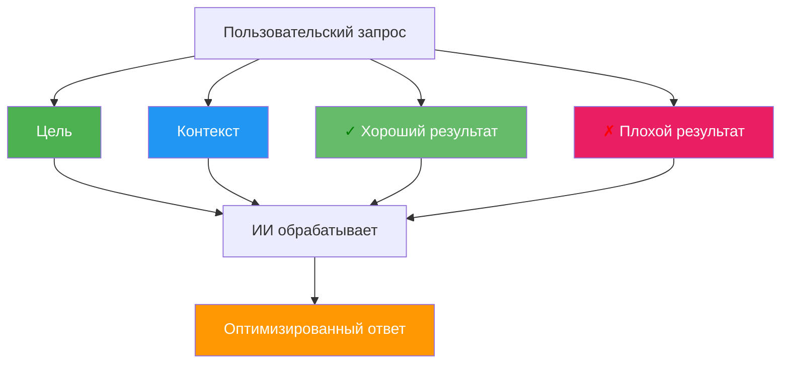

## Теоретические основания

### 1. Теория информации и энтропия

**Научное объяснение:**
Структурированный промпт снижает энтропию распределения вероятностей модели.

- Без структуры: модель опирается на априорное распределение P(y|x), где x — вход, y — выход. Энтропия H(Y|X) высока, что ведет к высокой неопределенности.
- Со структурой: добавление ограничений (goal, context, positive/negative examples) сужает гипотезное пространство и снижает условную энтропию H(Y|X, constraints).

Формульно: H(Y|X, G, C, E+) < H(Y|X), где G — цель, C — контекст, E+ — примеры.

**Простыми словами:**
Энтропия — это мера неопределенности. Чем больше вариантов ответа, тем выше энтропия. Структурированный промпт уменьшает количество возможных ответов, снижая неопределенность.

**Визуализация:**

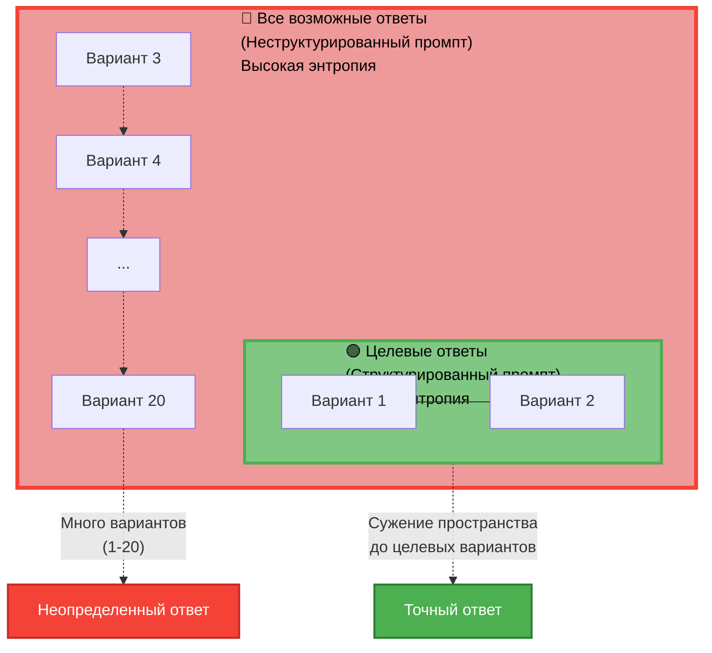

**Словарь терминов:**
- **Энтропия** — мера неопределенности/хаоса
- **Распределение вероятностей** — какие ответы модель считает более или менее вероятными
- **Априорное распределение** — то, что модель знает до вашего запроса
- **Условная энтропия** — неопределенность при заданных условиях
- **Гипотезное пространство** — все возможные варианты ответов

---

### 2. Принцип максимума энтропии и байесовский вывод

**Научное объяснение:**
Модель аппроксимирует байесовский вывод:

P(y|x) ∝ P(x|y) · P(y)

Структурированный промпт:
- Уточняет априор P(y) через цель и контекст
- Задает правдоподобие P(x|y) через примеры
- Снижает влияние нерелевантных паттернов из обучения

**Простыми словами:**
Модель оценивает вероятность ответа по формуле: вероятность ответа = (насколько ответ подходит под примеры) × (насколько ответ вероятен сам по себе). Структурированный промпт уточняет обе части формулы.

**Визуализация:**

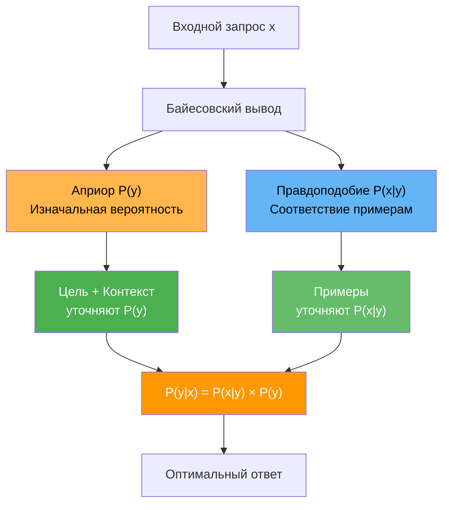

**Словарь терминов:**
- **Байесовский вывод** — способ оценки вероятности с учетом новой информации
- **Априор P(y)** — изначальная вероятность ответа
- **Правдоподобие P(x|y)** — насколько примеры подтверждают ответ
- **Паттерны** — повторяющиеся шаблоны в данных

---

### 3. Теория обучения с подсказками (Few-shot learning)

**Научное объяснение:**
Структура промпта реализует few-shot learning через in-context examples:

- Цель и контекст задают задачу
- Положительные примеры — демонстрации желаемого поведения
- Отрицательные примеры — контрастные примеры, сужающие гипотезное пространство

Механизм: модель использует attention для сопоставления входного запроса с примерами и генерации ответа по аналогии.

**Простыми словами:**
Модель учится на примерах прямо в запросе. Цель и контекст задают задачу, положительные примеры показывают как надо, отрицательные — как не надо. Модель сравнивает ваш запрос с примерами и отвечает по аналогии.

**Визуализация:**

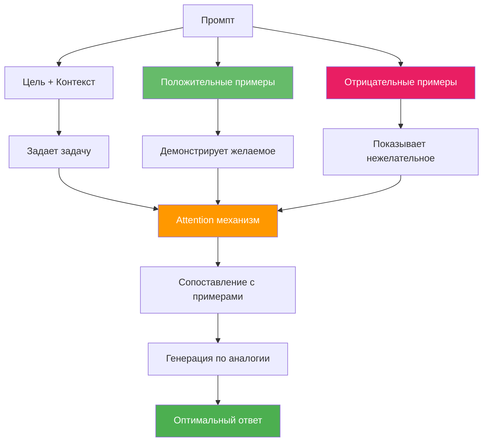

**Словарь терминов:**
- **Few-shot learning** — обучение на малом количестве примеров
- **In-context examples** — примеры, данные прямо в запросе
- **Attention** — механизм, который выделяет важные части входных данных
- **По аналогии** — используя похожие примеры

---

### 4. Когнитивная архитектура и активация релевантных паттернов

**Научное объяснение:**
В трансформерах:

- Цель активирует релевантные слои/головы внимания
- Контекст модулирует веса внимания
- Примеры создают шаблоны активации, которые модель воспроизводит

Формально: Attention(Q, K, V) = softmax(QK^T/√d_k)V, где структурированный промпт влияет на Q (query) и K (key), активируя нужные паттерны.

**Простыми словами:**
Модель состоит из слоев, которые активируются разными частями запроса. Цель включает нужные слои, контекст настраивает их работу, примеры задают шаблон активации. В итоге активируются нужные части модели.

**Визуализация:**

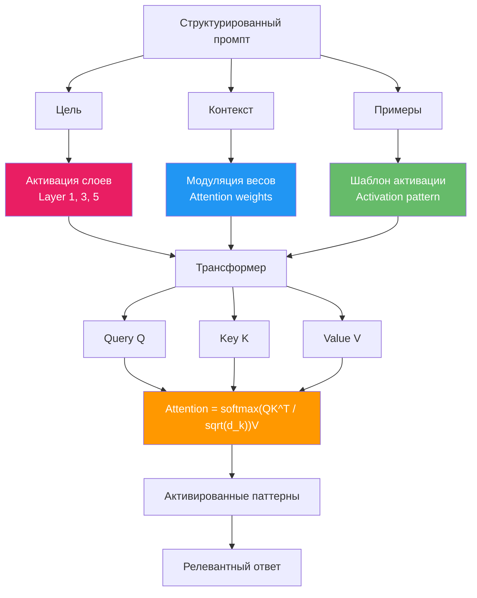

**Словарь терминов:**
- **Трансформер** — архитектура нейросети
- **Слои** — уровни обработки информации
- **Головы внимания** — части модели, которые выделяют важное
- **Веса внимания** — насколько сильно модель обращает внимание на разные части
- **Query (Q), Key (K), Value (V)** — компоненты механизма внимания
- **Softmax** — функция, превращающая числа в вероятности

---

### 5. Теория ограничений (Constraint Satisfaction)

**Научное объяснение:**
Структурированный промпт задает ограничения:

- Жесткие: цель и контекст (должны выполняться)
- Мягкие: примеры (предпочтительные паттерны)

Модель решает задачу удовлетворения ограничений, максимизируя вероятность при их соблюдении.

**Простыми словами:**
Промпт задает правила: цель и контекст — обязательные, примеры — желательные. Модель ищет ответ, который соблюдает обязательные правила и по возможности соответствует примерам.

**Визуализация:**

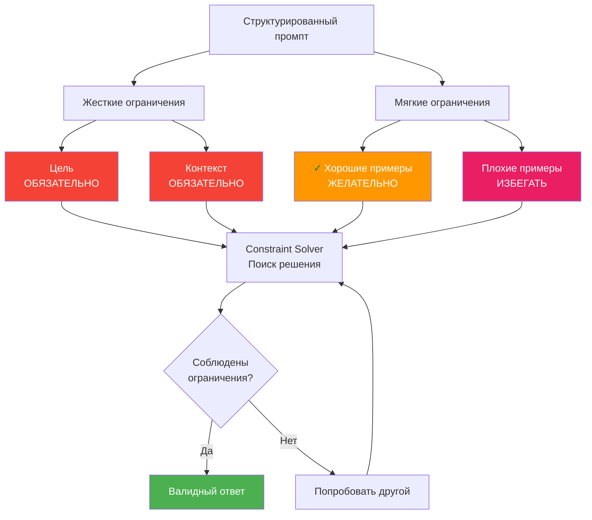

**Словарь терминов:**
- **Ограничения** — правила, которые нужно соблюдать
- **Жесткие ограничения** — обязательные правила
- **Мягкие ограничения** — желательные правила
- **Удовлетворение ограничений** — поиск решения, которое соблюдает правила

---

### 6. Индуктивный bias и обобщение

**Научное объяснение:**
Структура промпта вводит индуктивный bias:

- Цель задает целевую функцию
- Контекст — домен
- Примеры — гипотезное пространство

Это улучшает обобщение за счет сужения гипотезного пространства и снижения риска переобучения на нерелевантные паттерны.

**Простыми словами:**
Структура промпта задает предпочтения модели: цель — что искать, контекст — где искать, примеры — как искать. Это помогает модели лучше обобщать и не уходить в нерелевантные варианты.

**Визуализация:**

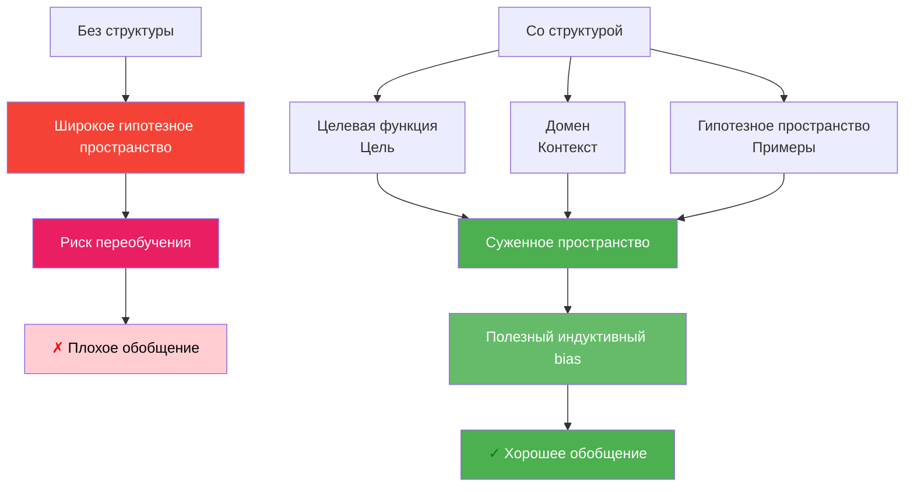

**Словарь терминов:**
- **Индуктивный bias** — предпочтения модели при обучении
- **Целевая функция** — что нужно максимизировать/минимизировать
- **Домен** — область применения (например, программирование, медицина)
- **Обобщение** — способность работать на новых данных
- **Переобучение** — когда модель запоминает детали вместо общих закономерностей

---

### 7. Теория оптимального контроля и регуляризация

**Научное объяснение:**
Структурированный промпт действует как регуляризатор:

- Цель — целевая функция
- Контекст — ограничения состояния
- Примеры — регуляризация через штраф за отклонение от желаемых паттернов

Формально: argmax_y [log P(y|x) + λ₁·R_goal(y) + λ₂·R_context(y) + λ₃·R_examples(y)]

**Простыми словами:**
Модель выбирает ответ, который одновременно вероятен и соответствует цели, контексту и примерам. Структура промпта добавляет штрафы за отклонение от желаемого, направляя выбор.

**Визуализация:**

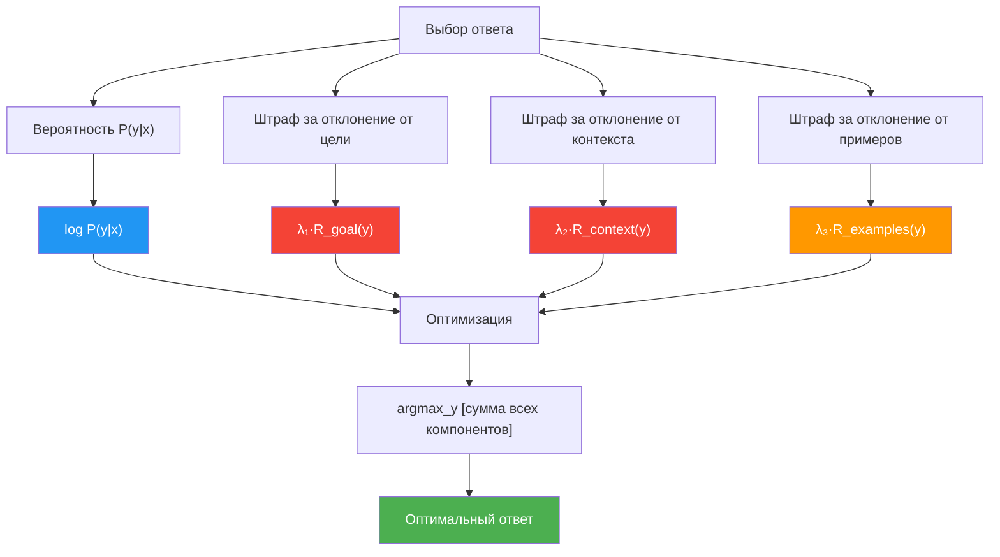

**Словарь терминов:**
- **Оптимальный контроль** — выбор наилучшего действия
- **Регуляризация** — способ ограничить модель, чтобы избежать переобучения
- **Штраф** — наказание за отклонение от желаемого
- **Argmax** — выбор варианта с максимальным значением
- **Lambda (λ)** — коэффициенты важности разных частей

---

### 8. Эмпирические подтверждения

**Научное объяснение:**
Исследования показывают:

- Chain-of-Thought: пошаговое рассуждение улучшает точность
- Few-shot prompting: примеры повышают производительность
- Negative prompting: отрицательные примеры снижают ошибки типа II

**Простыми словами:**
Эксперименты подтверждают: пошаговое рассуждение, примеры в запросе и отрицательные примеры улучшают результаты модели.

**Визуализация:**

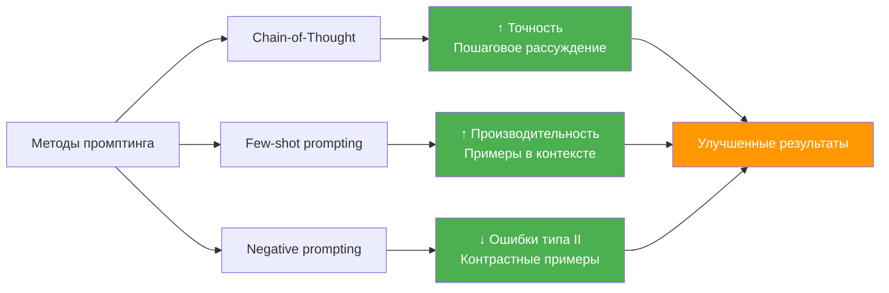

**Словарь терминов:**
- **Эмпирические** — основанные на опыте/экспериментах
- **Chain-of-Thought** — пошаговое рассуждение
- **Few-shot prompting** — запросы с примерами
- **Negative prompting** — запросы с отрицательными примерами
- **Ошибки типа II** — когда модель не находит то, что нужно найти

---

## Общая схема работы структурированного промпта

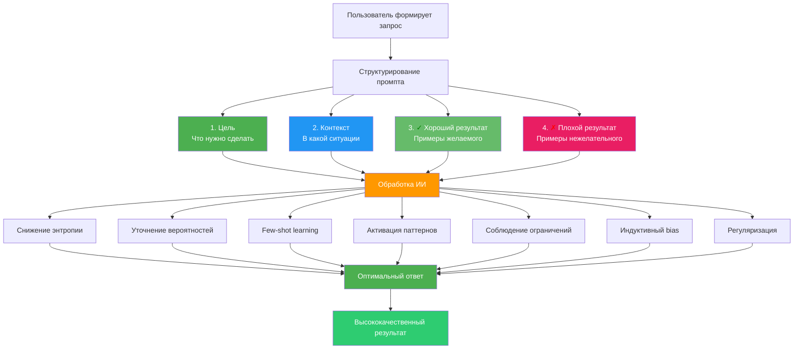

## Практический пример

### <span style="color: red;">✗</span> Плохой промпт:
```
Сделай дашборд для аналитики
```

### <span style="color: green;">✓</span> Хороший структурированный промпт:

**Цель:**
Пользователи не понимают, почему их заявка была отклонена. Нужно повысить прозрачность процесса рассмотрения заявок и снизить количество обращений в поддержку на 30%.

**Контекст:**
- Бизнес: снижение количества обращений в поддержку на 30%
- Пользователь: заемщики, которые подают заявку на кредит
- Технический: есть API для получения статусов заявки, данные обновляются раз в час
- Данные: есть история статусов, причины отклонения, временные метки

**<span style="color: green;">✓</span> Хороший результат:**
- Использовать компонент StatusTimeline из дизайн-системы
- Показывать причину отклонения сразу в карточке статуса (не скрывать в модальном окне)
- Использовать информационные иконки для объяснения терминов
- Следовать паттерну "Progressive Disclosure": сначала краткая информация, затем детали по запросу
- Использовать цветовую кодировку статусов из дизайн-системы (зеленый = одобрено, красный = отклонено)

**<span style="color: red;">✗</span> Плохой результат:**
- Скрывать важную информацию в модальных окнах
- Использовать технические термины без объяснений
- Показывать все данные сразу без группировки
- Нарушать цветовую схему дизайн-системы
- Создавать новые компоненты вместо использования существующих

## Работа с промптами: Структура для UX/UI дизайнера

### Как структурировать промпт

Структура промпта естественно делится на две части:

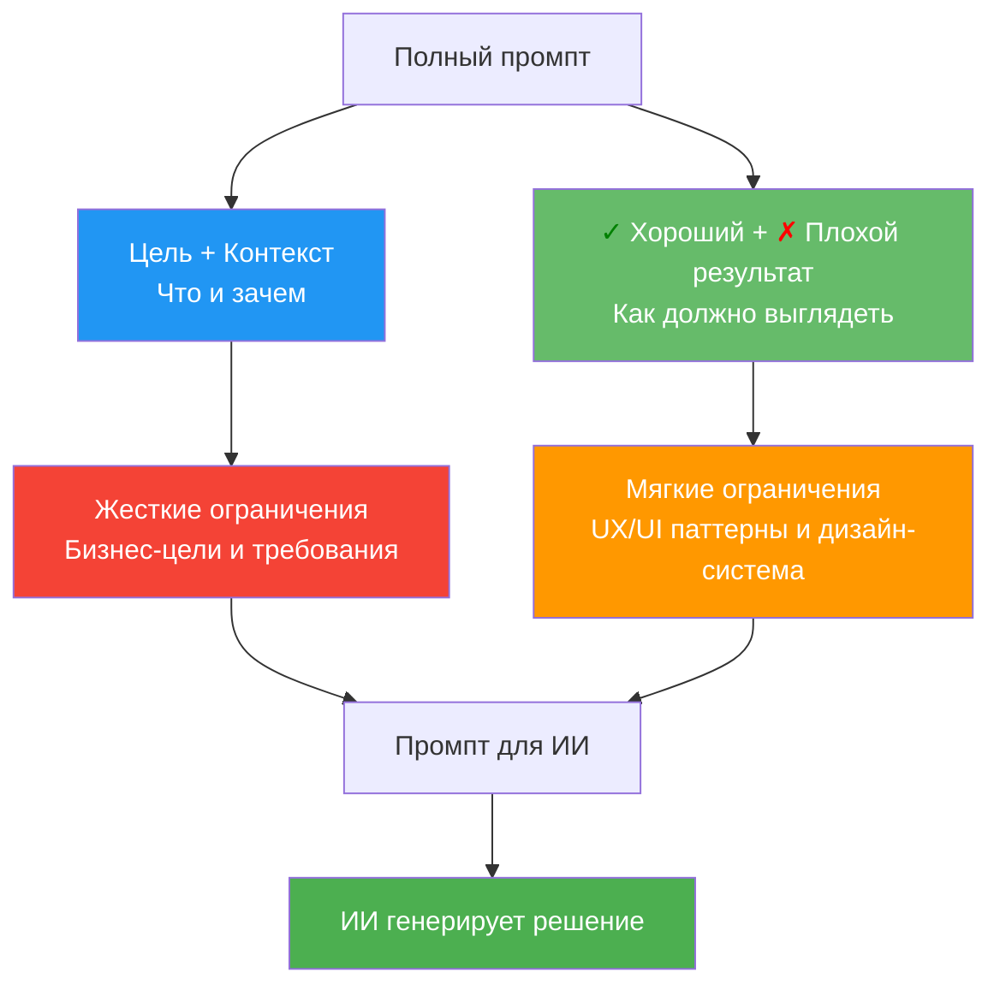

### Шаблон промпта для UX/UI дизайнера

**Ваша задача:** Создать полный структурированный промпт, который включает **ЧТО** нужно сделать, **В КАКОМ КОНТЕКСТЕ**, и **КАК** это должно выглядеть с точки зрения UX/UI.

**Шаблон:**

**Цель:**
[Что нужно достичь с точки зрения бизнеса/пользователя. Без упоминания конкретных UI-элементов]

**Контекст:**
- [Бизнес-контекст: какие метрики важны, какие проблемы решаем]
- [Пользовательский контекст: кто пользователь, какие у него потребности]
- [Технический контекст: ограничения платформы, существующие системы]
- [Данные: какие данные доступны, какие инсайты есть]

**<span style="color: green;">✓</span> Хороший результат:**
- [Примеры хороших UX-решений из дизайн-системы]
- [Паттерны, которые работают в нашем продукте]
- [Принципы, которым нужно следовать]

**<span style="color: red;">✗</span> Плохой результат:**
- [Примеры плохих UX-решений, которых нужно избегать]
- [Антипаттерны]
- [Типичные ошибки]

**Пример <span style="color: green;">✓</span> хорошего промпта:**

**Цель:**
Пользователи не понимают, почему их заявка была отклонена. Нужно повысить прозрачность процесса рассмотрения заявок.

**Контекст:**
- Бизнес: снижение количества обращений в поддержку на 30%
- Пользователь: заемщики, которые подают заявку на кредит
- Технический: есть API для получения статусов заявки, данные обновляются раз в час
- Данные: есть история статусов, причины отклонения, временные метки

**<span style="color: green;">✓</span> Хороший результат:**
- Использовать компонент StatusTimeline из дизайн-системы
- Показывать причину отклонения сразу в карточке статуса (не скрывать в модальном окне)
- Использовать информационные иконки для объяснения терминов
- Следовать паттерну "Progressive Disclosure": сначала краткая информация, затем детали по запросу
- Использовать цветовую кодировку статусов из дизайн-системы (зеленый = одобрено, красный = отклонено)

**<span style="color: red;">✗</span> Плохой результат:**
- Скрывать важную информацию в модальных окнах
- Использовать технические термины без объяснений
- Показывать все данные сразу без группировки
- Нарушать цветовую схему дизайн-системы
- Создавать новые компоненты вместо использования существующих

**Пример <span style="color: red;">✗</span> плохого промпта (с конкретными UI-решениями в Цели/Контексте):**

**Цель:**
Сделать страницу со статусом заявки с таймлайном и модальным окном с деталями.

**Контекст:**
- Нужна кнопка "Подробнее" справа вверху
- Таймлайн должен быть вертикальным
- Модальное окно должно открываться по клику

**Почему это плохо:**
Когда вы описываете конкретные UI-решения в Цели и Контексте, это создает **индуктивный bias** для ИИ. ИИ видит конкретное решение и невольно начинает его реализовывать вместо того, чтобы найти оптимальное решение с точки зрения UX/UI и дизайн-системы.

### Практический пример полного промпта

**Цель:**
Пользователи не могут быстро найти нужный отчет среди 50+ вариантов. Нужно улучшить навигацию по отчетам.

**Контекст:**
- Бизнес: пользователи тратят в среднем 3 минуты на поиск отчета
- Пользователь: аналитики, которые используют отчеты ежедневно
- Технический: отчеты хранятся в иерархической структуре (категории → подкатегории → отчеты)
- Данные: есть данные о популярности отчетов, частоте использования, поисковых запросах

**<span style="color: green;">✓</span> Хороший результат:**
- Использовать компонент SearchWithFilters из дизайн-системы
- Показывать популярные отчеты в отдельной секции "Часто используемые"
- Использовать паттерн "Recent Items" для быстрого доступа
- Группировать по категориям с иконками из дизайн-системы
- Использовать автодополнение в поиске с подсветкой совпадений

**<span style="color: red;">✗</span> Плохой результат:**
- Простой список из 50+ элементов без группировки
- Поиск без автодополнения
- Отсутствие истории недавних отчетов
- Нарушение иерархии навигации дизайн-системы
- Создание нового компонента поиска вместо использования существующего

**Результат:**
ИИ получает полный промпт и генерирует решение, которое:
- Соответствует бизнес-целям
- Следует UX/UI-паттернам
- Использует дизайн-систему

### Чек-лист для UX/UI дизайнера

- [ ] Я описал Цель без упоминания конкретных UI-элементов (фокус на бизнес-целях и проблемах пользователя)
- [ ] Я описал Контекст (бизнес, пользователь, технический, данные)
- [ ] Я НЕ упомянул конкретные UI-элементы в Цели/Контексте (кнопки, модальные окна, таблицы)
- [ ] Я НЕ описал визуальные решения в Цели/Контексте (цвета, размеры, расположение)
- [ ] Я добавил примеры <span style="color: green;">✓</span> хороших UX/UI-решений из дизайн-системы
- [ ] Я описал антипаттерны, которых нужно избегать
- [ ] Я использовал существующие компоненты дизайн-системы
- [ ] Я учел принципы UX (Progressive Disclosure, Feedback, Consistency)

## Описание правил для ИИ: Формат и примеры

### Зачем нужны правила

Правила — это способ зафиксировать ограничения и предпочтения проекта, чтобы ИИ (например, Cursor) всегда их учитывал при генерации UI/UX решений. Правила работают как **жесткие ограничения** в структурированном промпте.

**Преимущества правил:**
- Не нужно повторять одни и те же требования в каждом промпте
- Снижается энтропия: ИИ всегда знает ограничения проекта
- Единообразие: все решения следуют одним принципам
- Перелинковка: правила ссылаются друг на друга, создавая систему

### Формат правил в Cursor

В Cursor правила хранятся в файле `.cursorrules` в корне проекта. Это текстовый файл с четкой структурой.

**Базовая структура:**
```
# Название раздела правил

## Подраздел

### Правило
Описание правила с примерами.

### Другое правило
Еще одно правило.
```

### Примеры правил для дизайн-системы

**Файл: `.cursorrules` (секция дизайн-системы)**

```markdown
# Дизайн-система

## Компоненты

### Использование существующих компонентов
ВСЕГДА используй компоненты из дизайн-системы перед созданием новых.

**Доступные компоненты:**
- `Button` (variants: primary, secondary, ghost)
- `Input` (с валидацией и ошибками)
- `Card` (с заголовком и действиями)
- `StatusTimeline` (для отображения статусов)
- `SearchWithFilters` (поиск с фильтрами)
- `DataTable` (таблица с сортировкой и пагинацией)

**Правило:**
- ✅ Используй компонент Button из дизайн-системы с вариантами: primary, secondary, ghost
- ✅ Следуй стилям кнопок из дизайн-системы (размеры, отступы, скругления)
- ❌ НЕ создавай новый дизайн кнопки
- ❌ НЕ используй произвольные стили для кнопок

**Пример визуального использования:**
- ✅ Правильно: Кнопка "Отправить" использует стиль primary из дизайн-системы (синий фон, белый текст, высота 40px, скругление 8px)
- ❌ Неправильно: Кнопка с красным фоном и желтым текстом, высота 35px, скругление 4px (не соответствует дизайн-системе)

### Цветовая схема
Используй ТОЛЬКО цвета из дизайн-системы.

**Цвета статусов:**
- `status.success` → зеленый (#4CAF50) для успешных действий
- `status.error` → красный (#F44336) для ошибок
- `status.warning` → оранжевый (#FF9800) для предупреждений
- `status.info` → синий (#2196F3) для информации

**Правило:**
- ✅ Используй ТОЛЬКО цвета статусов из дизайн-системы
- ✅ Применяй цвета консистентно: зеленый всегда для успеха, красный для ошибок
- ❌ НЕ используй произвольные цвета для статусов
- ❌ НЕ создавай новые цвета статусов без согласования

**Пример визуального использования:**
- ✅ Правильно: Статус "Одобрено" отображается зеленым цветом (#4CAF50) с иконкой галочки
- ❌ Неправильно: Статус "Одобрено" отображается синим цветом или другим оттенком зеленого

### Типографика
Используй ТОЛЬКО типографические стили из дизайн-системы.

**Доступные стили:**
- `typography.h1` → заголовок первого уровня (32px, bold)
- `typography.h2` → заголовок второго уровня (24px, bold)
- `typography.body` → основной текст (16px, regular)
- `typography.caption` → подпись (12px, regular)

**Правило:**
- ✅ Используй ТОЛЬКО стили типографики из дизайн-системы
- ✅ Применяй правильную иерархию: h1 для главных заголовков, h2 для подзаголовков, body для текста
- ❌ НЕ задавай произвольные размеры шрифтов
- ❌ НЕ смешивай стили типографики (например, h1 размер с body весом)

**Пример визуального использования:**
- ✅ Правильно: Заголовок страницы использует стиль h1 (32px, bold, межстрочный интервал 1.2)
- ❌ Неправильно: Заголовок страницы использует размер 28px или 36px, или обычный вес вместо bold

### Spacing (отступы)
Используй систему отступов из дизайн-системы.

**Доступные отступы:**
- `spacing.xs` → 4px
- `spacing.sm` → 8px
- `spacing.md` → 16px
- `spacing.lg` → 24px
- `spacing.xl` → 32px

**Правило:**
- ✅ Используй ТОЛЬКО значения отступов из дизайн-системы (xs: 4px, sm: 8px, md: 16px, lg: 24px, xl: 32px)
- ✅ Следуй правилу 8px grid (все отступы кратны 8)
- ✅ Используй консистентные отступы: одинаковые элементы должны иметь одинаковые отступы
- ❌ НЕ используй произвольные значения отступов (например, 15px, 13px, 27px)
- ❌ НЕ смешивай разные системы отступов в одном интерфейсе

**Пример визуального использования:**
- ✅ Правильно: Карточка имеет внутренние отступы 16px (md), внешние отступы между карточками 24px (lg)
- ❌ Неправильно: Карточка имеет внутренние отступы 18px или 14px, внешние отступы 20px или 25px

## Паттерны UX

### Progressive Disclosure
Следуй принципу прогрессивного раскрытия информации.

**Правило:**
- ✅ Показывай сначала краткую информацию
- ✅ Детали — по запросу (клик, ховер, раскрытие)
- ❌ НЕ показывай все данные сразу
- ❌ НЕ скрывай критически важную информацию

**Пример визуального использования:**
- ✅ Правильно: Карточка заявки показывает краткую информацию (статус, дата, сумма), кнопка "Подробнее" раскрывает детали (история статусов, комментарии) по клику
- ❌ Неправильно: Карточка заявки показывает все данные сразу (статус, дата, сумма, история, комментарии, документы) без возможности скрыть детали

### Feedback (Обратная связь)
Всегда предоставляй обратную связь пользователю.

**Правило:**
- ✅ Показывай состояние загрузки для асинхронных операций
- ✅ Показывай успех/ошибку после действий
- ✅ Используй скелетоны вместо спиннеров для контента
- ❌ НЕ оставляй пользователя без обратной связи

**Пример визуального использования:**
- ✅ Правильно: При загрузке данных показывается скелетон таблицы (серые прямоугольники с анимацией), после загрузки — данные; при ошибке — сообщение об ошибке с кнопкой "Повторить"
- ❌ Неправильно: При загрузке показывается пустой экран или спиннер на весь экран; при ошибке — ничего не показывается или только техническое сообщение

### Accessibility (Доступность)
Всегда учитывай доступность.

**Правило:**
- ✅ Используй семантические HTML-элементы
- ✅ Добавляй `aria-label` для иконок без текста
- ✅ Обеспечивай навигацию с клавиатуры
- ✅ Используй достаточный контраст цветов (WCAG AA минимум)
- ❌ НЕ используй только цвет для передачи информации

**Пример визуального использования:**
- ✅ Правильно: Кнопка закрытия модального окна имеет иконку крестика, достаточный размер для клика (минимум 44x44px), визуальную обратную связь при наведении, работает с клавиатуры (Enter/Escape)
- ❌ Неправильно: Кнопка закрытия — маленький крестик без подписи, размер меньше 44x44px, нет обратной связи при наведении, не работает с клавиатуры
```

### Примеры правил для платформенных ограничений

**Файл: `.cursorrules` (секция ограничений платформы)**

```markdown
# Платформенные ограничения

## Размеры экранов

### Адаптивность
Дизайн должен работать на всех размерах экранов.

**Правило:**
- ✅ Используй мобильный-first подход
- ✅ Проектируй для breakpoints: mobile (320px+), tablet (768px+), desktop (1024px+)
- ✅ Тестируй на реальных устройствах или эмуляторах
- ❌ НЕ проектируй только для desktop
- ❌ НЕ используй фиксированные ширины элементов

**Пример визуального использования:**
- ✅ Правильно: Таблица на мобильных превращается в карточки, навигация сворачивается в гамбургер-меню
- ❌ Неправильно: Таблица на мобильных обрезается или требует горизонтальной прокрутки, навигация не помещается на экран

### Плотность информации
Контролируй количество информации на экране.

**Правило:**
- ✅ Показывай максимум 7±2 элемента в списке без группировки
- ✅ Используй группировку и категории для больших списков
- ✅ Применяй визуальную иерархию для выделения важного
- ❌ НЕ показывай более 10-15 элементов одновременно без группировки
- ❌ НЕ перегружай экран информацией

**Пример визуального использования:**
- ✅ Правильно: Список из 50 отчетов группируется по категориям (Финансы, Маркетинг, Продажи), каждая категория сворачивается/раскрывается
- ❌ Неправильно: Список из 50 отчетов показывается одним длинным списком без группировки

## Производительность визуальная

### Загрузка контента
Показывай состояние загрузки правильно.

**Правило:**
- ✅ Используй скелетоны для контента (таблицы, карточки, списки)
- ✅ Используй спиннеры только для небольших действий (кнопки, иконки)
- ✅ Показывай прогресс для длительных операций
- ❌ НЕ используй спиннеры на весь экран для загрузки контента
- ❌ НЕ оставляй пустой экран при загрузке

**Пример визуального использования:**
- ✅ Правильно: При загрузке таблицы показывается скелетон таблицы (серые прямоугольники с анимацией пульсации)
- ❌ Неправильно: При загрузке таблицы показывается спиннер по центру экрана или ничего не показывается

### Анимации
Используй анимации осознанно.

**Правило:**
- ✅ Используй плавные переходы для состояний (200-300ms)
- ✅ Анимируй только важные изменения (появление модального окна, переход между страницами)
- ✅ Используй easing функции из дизайн-системы (ease-in-out, ease-out)
- ❌ НЕ используй слишком быстрые (<100ms) или медленные (>500ms) анимации
- ❌ НЕ анимируй все элементы одновременно

**Пример визуального использования:**
- ✅ Правильно: Модальное окно появляется с плавным fade-in и slide-up (300ms, ease-out)
- ❌ Неправильно: Модальное окно появляется мгновенно или с очень медленной анимацией (1 секунда)

## Ограничения взаимодействия

### Время отклика
Обеспечивай быструю обратную связь.

**Правило:**
- ✅ Показывай визуальную обратную связь сразу при клике/наведении (<100ms)
- ✅ Показывай состояние загрузки для операций >500ms
- ✅ Используй оптимистичные обновления UI (показывай результат до подтверждения сервера)
- ❌ НЕ оставляй пользователя без обратной связи при действиях
- ❌ НЕ показывай загрузку для мгновенных операций

**Пример визуального использования:**
- ✅ Правильно: При клике на кнопку она сразу меняет состояние (визуальная обратная связь), затем показывается индикатор загрузки, если операция длится >500ms
- ❌ Неправильно: При клике на кнопку ничего не происходит, пользователь не понимает, зарегистрировался ли клик

### Ошибки и валидация
Показывай ошибки понятно и вовремя.

**Правило:**
- ✅ Показывай ошибки валидации сразу при вводе (inline validation)
- ✅ Используй понятные сообщения об ошибках (не технические термины)
- ✅ Выделяй поля с ошибками визуально (красная рамка, иконка ошибки)
- ✅ Показывай общие ошибки в понятном месте (не в консоли)
- ❌ НЕ показывай технические сообщения об ошибках пользователю
- ❌ НЕ скрывай ошибки валидации до отправки формы

**Пример визуального использования:**
- ✅ Правильно: При вводе неверного email поле сразу подсвечивается красным, под полем появляется сообщение "Введите корректный email адрес"
- ❌ Неправильно: Ошибка показывается только после отправки формы внизу страницы техническим сообщением "ValidationError: Invalid email format"
```

### Примеры правил для UX ограничений

**Файл: `.cursorrules` (секция UX ограничений)**

```markdown
# UX ограничения

## Информационная архитектура

### Лимиты отображения данных
Контролируй количество информации на экране.

**Правило:**
- ✅ Показывай максимум 50 элементов в списке без пагинации
- ✅ Используй пагинацию или бесконечную прокрутку для больших списков (50+ элементов)
- ✅ Группируй элементы по категориям, если их больше 10-15
- ✅ Используй поиск и фильтры для навигации по большим наборам данных
- ❌ НЕ показывай все данные сразу, если их больше 50
- ❌ НЕ создавай длинные списки без возможности навигации

**Пример визуального использования:**
- ✅ Правильно: Список из 100 отчетов показывается по 20 на странице с пагинацией внизу, есть поиск и фильтры по категориям
- ❌ Неправильно: Список из 100 отчетов показывается одним длинным списком, требующим прокрутки на несколько экранов

### Иерархия информации
Создавай четкую визуальную иерархию.

**Правило:**
- ✅ Выделяй важную информацию размером, цветом, контрастом
- ✅ Используй группировку для связанных элементов
- ✅ Применяй правило близости: связанные элементы должны быть рядом
- ✅ Используй белое пространство для разделения секций
- ❌ НЕ делай все элементы одинаково важными визуально
- ❌ НЕ перегружай экран информацией без группировки

**Пример визуального использования:**
- ✅ Правильно: Главный заголовок страницы крупнее (32px), подзаголовки секций средние (24px), текст карточек обычный (16px); секции разделены отступами 32px
- ❌ Неправильно: Все тексты одного размера, нет визуального разделения секций, все элементы выглядят одинаково важными

## Доступность (Accessibility)

### Контрастность
Обеспечивай достаточный контраст для читаемости.

**Правило:**
- ✅ Используй контраст минимум 4.5:1 для обычного текста (WCAG AA)
- ✅ Используй контраст минимум 3:1 для крупного текста (18px+) и UI компонентов
- ✅ Проверяй контраст с помощью инструментов (WebAIM Contrast Checker)
- ❌ НЕ используй серый текст на сером фоне
- ❌ НЕ полагайся только на цвет для передачи информации

**Пример визуального использования:**
- ✅ Правильно: Текст на белом фоне имеет цвет #333333 (контраст 12.6:1), текст на цветном фоне проверен на контрастность
- ❌ Неправильно: Серый текст (#999999) на светло-сером фоне (#F5F5F5) с контрастом 2.1:1

### Навигация с клавиатуры
Обеспечивай возможность навигации без мыши.

**Правило:**
- ✅ Все интерактивные элементы должны быть доступны с клавиатуры (Tab)
- ✅ Показывай визуальный индикатор фокуса (focus state)
- ✅ Используй логический порядок табуляции
- ✅ Поддерживай стандартные горячие клавиши (Enter для подтверждения, Escape для закрытия)
- ❌ НЕ скрывай индикатор фокуса
- ❌ НЕ создавай элементы, доступные только мышью

**Пример визуального использования:**
- ✅ Правильно: При навигации Tab кнопки получают видимую рамку фокуса (синяя, 2px), модальные окна закрываются по Escape
- ❌ Неправильно: При навигации Tab ничего не видно, пользователь не понимает, где находится фокус; модальные окна не закрываются по Escape

### Семантика и структура
Используй правильную семантическую структуру.

**Правило:**
- ✅ Используй правильные заголовки (h1, h2, h3) для структуры страницы
- ✅ Группируй связанные элементы (fieldset, списки)
- ✅ Используй подписи (labels) для полей ввода
- ✅ Добавляй альтернативный текст для изображений
- ❌ НЕ используй заголовки только для стилизации
- ❌ НЕ создавай структуру только визуально без семантики

**Пример визуального использования:**
- ✅ Правильно: Страница имеет один h1 "Отчеты", секции имеют h2 "Финансовые отчеты", "Маркетинговые отчеты"; поля формы имеют подписи
- ❌ Неправильно: Все заголовки используют div с большим шрифтом, нет семантической структуры; поля формы без подписей

## Состояния интерфейса

### Офлайн режим
Показывай состояние отсутствия интернета.

**Правило:**
- ✅ Показывай индикатор офлайн режима (бanner вверху страницы)
- ✅ Позволяй просматривать кешированные данные
- ✅ Показывай, какие функции недоступны без интернета
- ✅ Предупреждай пользователя о необходимости интернета для критичных действий
- ❌ НЕ блокируй весь интерфейс при отсутствии интернета
- ❌ НЕ показывай технические ошибки вместо понятного сообщения

**Пример визуального использования:**
- ✅ Правильно: При потере интернета показывается желтый banner "Нет подключения к интернету. Некоторые функции могут быть недоступны", кешированные данные остаются доступными
- ❌ Неправильно: При потере интернета показывается техническая ошибка "NetworkError" или весь интерфейс становится недоступным

### Ошибки и пустые состояния
Показывай понятные сообщения об ошибках и пустых состояниях.

**Правило:**
- ✅ Используй понятные сообщения на языке пользователя
- ✅ Предлагай действия для решения проблемы (кнопка "Повторить", ссылка на помощь)
- ✅ Используй иллюстрации или иконки для пустых состояний
- ✅ Объясняй, почему состояние пустое ("Нет отчетов" vs "Создайте первый отчет")
- ❌ НЕ показывай технические сообщения об ошибках
- ❌ НЕ оставляй пустые экраны без объяснения

**Пример визуального использования:**
- ✅ Правильно: При ошибке загрузки показывается сообщение "Не удалось загрузить отчеты" с иконкой ошибки и кнопкой "Повторить попытку"
- ❌ Неправильно: При ошибке показывается "Error 500: Internal Server Error" или пустой экран без объяснения
```

### Перелинковка правил

Правила должны ссылаться друг на друга, создавая систему знаний.

**Пример перелинковки:**

```markdown
# Дизайн-система

## Компоненты

### Использование существующих компонентов
ВСЕГДА используй компоненты из дизайн-системы перед созданием новых.

**Связанные правила:**
- См. [Цветовая схема](#цветовая-схема) для цветов компонентов
- См. [Типографика](#типографика) для текстовых элементов
- См. [Spacing](#spacing-отступы) для отступов компонентов
- См. [Паттерны UX → Feedback](#feedback-обратная-связь) для состояний компонентов

**Доступные компоненты:**
- `Button` (variants: primary, secondary, ghost) — см. [Цветовая схема](#цветовая-схема)
- `Input` (с валидацией и ошибками) — см. [UX ограничения → Ошибки и валидация](#ошибки-и-валидация)
- `Card` (с заголовком и действиями) — см. [Spacing](#spacing-отступы)
- `StatusTimeline` (для отображения статусов) — см. [Цветовая схема → Цвета статусов](#цветовая-схема)
```

**Формат ссылок:**
- Внутренние ссылки: `[Текст](#якорь)` (для Markdown)
- Ссылки на файлы: `[Название](./path/to/file.md)`
- Ссылки на секции: `[Секция → Подсекция](#якорь)`

### Структура файла `.cursorrules`

**Рекомендуемая структура:**

```markdown
# Правила проекта [Название проекта]

## Содержание
1. [Дизайн-система](#дизайн-система)
2. [Платформенные ограничения](#платформенные-ограничения)
3. [UX ограничения](#ux-ограничения)
4. [Паттерны UX](#паттерны-ux)

---

# Дизайн-система
[Правила дизайн-системы]

---

# Платформенные ограничения
[Правила ограничений платформы]

---

# UX ограничения
[Правила UX ограничений]

---

# Паттерны UX
[Правила паттернов]
```

### Использование правил в промптах

**Как ссылаться на правила в промпте:**

```
**Цель:**
[Цель задачи]

**Контекст:**
[Контекст задачи]

**Правила:**
- Следуй правилам из `.cursorrules` (секции: Дизайн-система, Платформенные ограничения, UX ограничения)
- Используй компоненты из дизайн-системы (см. `.cursorrules` → Компоненты)
- Соблюдай ограничения отображения данных (см. `.cursorrules` → UX ограничения → Лимиты отображения данных)

**✓ Хороший результат:**
[Примеры с учетом правил]

**✗ Плохой результат:**
[Антипаттерны, нарушающие правила]
```

**Пример полного промпта с правилами:**

```
**Цель:**
Создать страницу со списком отчетов с возможностью поиска и фильтрации.

**Контекст:**
- Пользователь: аналитики, которые используют отчеты ежедневно
- Бизнес: пользователи тратят в среднем 3 минуты на поиск отчета среди 100+ вариантов
- Данные: может быть 100+ отчетов, есть данные о популярности и частоте использования

**Правила:**
- Используй компоненты из дизайн-системы (`.cursorrules` → Дизайн-система → Компоненты)
- Используй `SearchWithFilters` для поиска (`.cursorrules` → Дизайн-система → Компоненты)
- Используй пагинацию для списков >50 элементов (`.cursorrules` → UX ограничения → Лимиты отображения данных)
- Следуй принципу Progressive Disclosure (`.cursorrules` → Дизайн-система → Паттерны UX)
- Показывай состояние загрузки правильно (`.cursorrules` → Платформенные ограничения → Загрузка контента)

**✓ Хороший результат:**
- Использовать компонент `SearchWithFilters` из дизайн-системы
- Использовать `DataTable` с пагинацией (20 элементов на страницу) для списка отчетов
- Показывать краткую информацию в карточке (название, дата, статус), детали — по клику
- Использовать цвета статусов из дизайн-системы (зеленый для активных, серый для архивных)
- Показывать скелетон таблицы при загрузке данных
- Группировать отчеты по категориям (Финансы, Маркетинг, Продажи)

**✗ Плохой результат:**
- Создавать новый компонент поиска вместо `SearchWithFilters`
- Показывать все 100+ отчетов сразу без пагинации или группировки
- Показывать все данные сразу без возможности скрыть детали
- Использовать произвольные цвета вместо цветов из дизайн-системы
- Показывать спиннер на весь экран при загрузке вместо скелетона
- Не группировать отчеты, показывать плоским списком
```

### Чек-лист для создания правил

**Для UX/UI дизайнера:**
- [ ] Я описал все компоненты дизайн-системы с визуальными примерами использования
- [ ] Я указал цветовую схему, типографику и spacing с конкретными значениями
- [ ] Я описал паттерны UX, которые нужно соблюдать
- [ ] Я описал ограничения отображения данных (лимиты элементов, группировка)
- [ ] Я указал требования к доступности (контрастность, навигация с клавиатуры)
- [ ] Я описал требования к состояниям интерфейса (офлайн, ошибки, пустые состояния)
- [ ] Я добавил ссылки на связанные правила
- [ ] Я привел визуальные примеры правильного и неправильного использования

### Формат правил: Best Practices

**1. Структура правила:**
```
### Название правила
Краткое описание правила.

**Правило:**
- ✅ Что делать
- ❌ Чего избегать

**Пример визуального использования:**
[Визуальное описание правильного и неправильного использования]

**Связанные правила:**
- [Ссылка на связанное правило](#якорь)
```

**2. Использование эмодзи и форматирования:**
- ✅ для правильных действий
- ❌ для неправильных действий
- **Жирный текст** для важных терминов
- Визуальные описания вместо примеров кода
- Ссылки на другие правила для перелинковки

**3. Примеры:**
- Всегда включай визуальные описания правильного и неправильного использования
- Примеры должны быть конкретными и применимыми к UI/UX
- Используй реальные компоненты и паттерны из дизайн-системы проекта
- Описывай визуальные характеристики (цвета, размеры, отступы, состояния)

**4. Перелинковка:**
- Ссылайся на связанные правила
- Используй якоря для навигации внутри документа
- Группируй связанные правила в секции

## Заключение

Структурированный промпт эффективен, потому что:

**Научно:**
1. Снижает энтропию выходного распределения
2. Уточняет байесовские априоры
3. Реализует few-shot learning in-context
4. Активирует релевантные паттерны через механизм внимания
5. Задает ограничения для поиска решения
6. Вводит полезный индуктивный bias
7. Регуляризует генерацию

**Простыми словами:**
1. Уменьшает неопределенность
2. Уточняет, что модель знает заранее
3. Дает примеры прямо в запросе
4. Включает нужные части модели
5. Задает правила, которым нужно следовать
6. Направляет модель в нужную сторону
7. Предотвращает нежелательные ответы

Это соответствует принципам теории информации, байесовского вывода и архитектуры трансформеров, а также тому, как люди лучше понимают задачи с четкими инструкциями.
