# Единый справочник по Layout системам

## Введение

Layout (макет/сетка) — это фундамент любого интерфейса. Он определяет структуру, ритм и адаптивность продукта. В этом справочнике собраны основные подходы к построению сеток, используемые в более чем 40 современных дизайн-системах.

Справочник поможет UX/UI дизайнерам быстро выбрать подходящую методологию, увидеть "как у других" и избежать распространенных ошибок.

---

## Содержание

1.  [Лучшие практики: Хорошо и Плохо](#1-лучшие-практики-хорошо-и-плохо)
2.  [Классическая 12-колоночная сетка](#2-классическая-12-колоночная-сетка)
3.  [Концепция 2x Grid (Carbon Design)](#3-концепция-2x-grid-carbon-design)
4.  [Utility-First и CSS Grid подходы](#4-utility-first-и-css-grid-подходы)
5.  [Адаптивность и Breakpoints](#5-адаптивность-и-breakpoints)
6.  [Отступы (Gutters и Margins)](#6-отступы-gutters-и-margins)
7.  [Каталог дизайн-систем (40+)](#7-каталог-дизайн-систем)
8.  [Layout паттерны для SaaS интерфейсов](#8-layout-паттерны-для-saas-интерфейсов)
9.  [SaaS Layout Components](#9-saas-layout-components)
10. [Режимы плотности контента (Density)](#10-режимы-плотности-контента-density)
11. [Accessibility в Layout системах](#11-accessibility-в-layout-системах)
12. [Производительность Layout](#12-производительность-layout)
13. [Инструменты для работы с Layout](#13-инструменты-для-работы-с-layout)
14. [Чеклист при создании Layout](#14-чеклист-при-создании-layout)
15. [Примеры реализации](#15-примеры-реализации)
16. [Разделение экрана на зоны (Zoning)](#16-разделение-экрана-на-зоны-zoning)
17. [Продвинутые техники](#17-продвинутые-техники)

---

## 1. Лучшие практики: Хорошо и Плохо

Прежде чем углубляться в параметры, важно понимать общие принципы работы с сетками.

### 1.1. Галерея примеров (Do's & Don'ts)

Наглядные примеры из ведущих дизайн-систем, показывающие, как правильно и неправильно использовать сетку.

#### Выравнивание (Alignment)
*   **Adobe Spectrum**: Не выравнивайте каждый атом по сетке.
    *   ❌ **Don't**: Пытаться выровнять иконки, лейблы и границы кнопок строго по колонкам сетки. Это ломает внутреннюю композицию компонента.
    *   ✅ **Do**: Выравнивайте по сетке только контейнеры и крупные регионы (карточки, панели).
    *   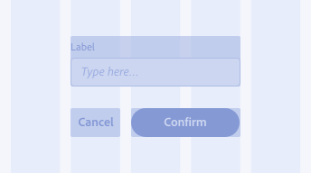
    *   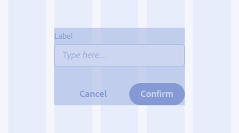

*   **Dell Design System**:
    *   ✅ **Do**: Контент должен начинаться и заканчиваться по краям колонок.
    *   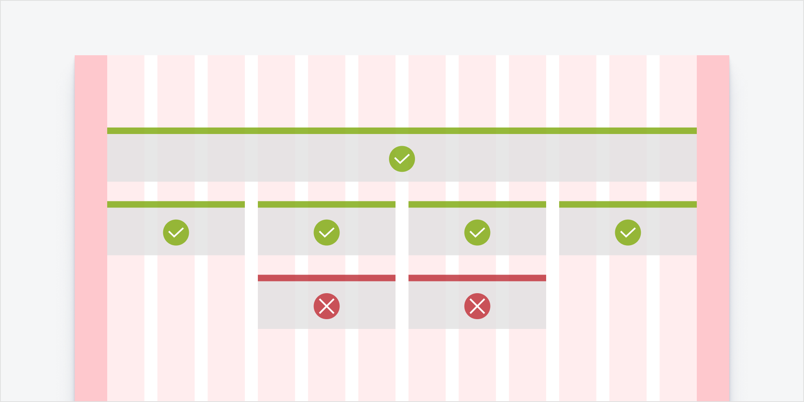

#### Отступы (Gutters & Gaps)
*   **Adobe Spectrum**:
    *   ❌ **Don't**: Не размещайте контент внутри отступов (gutters). Отступы должны оставаться пустыми для разделения блоков.
    *   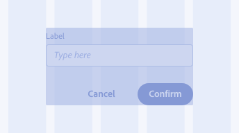

*   **Dell Design System**:
    *   ❌ **Don't**: Не используйте gutter для создания отступов внутри компонента.
    *   ✅ **Do**: Используйте padding внутри контейнера, если нужно отодвинуть контент от края колонки.

#### Формы и Ширина контента
*   **PENCIL (Brainly)**:
    *   ✅ **Do**: Для базовых форм используйте центрированный макет шириной 6 колонок (на широких экранах 1280px+).
    *   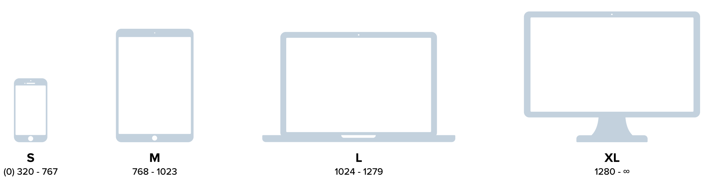
    *   ❌ **Don't**: Не растягивайте текстовый контент на всю ширину (12 колонок). Это делает строки слишком длинными для чтения.
    *   

#### Навигация и Контекст
*   **GitHub Primer**:
    *   ✅ **Do**: Используйте иерархию `:owner / :repository` в хлебных крошках.
    *   ❌ **Don't**: Не показывайте полный путь `:owner / :repository / Issues` в заголовке. Используйте локальную навигацию (табы) для переключения между разделами (Issues, PRs).
    *   ❌ **Don't**: Не размещайте выпадающие списки или кнопки действий внутри строки хлебных крошек.

#### Панели и Рельсы (Panels & Rails)
*   **Adobe Spectrum**:
    *   ✅ **Do**: Боковые панели должны *сдвигать* сетку (уменьшать доступную ширину), а не перекрывать её (на десктопе).
    *   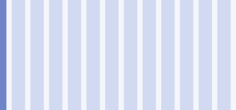

---

### ✅ Хорошо (Do's)

*   **Выравнивайте контейнеры, а не контент.** Сетка нужна для расположения основных блоков (карточек, панелей). Внутренний контент (текст внутри кнопки, иконка внутри инпута) должен жить по своим правилам (padding), а не привязываться к глобальным колонкам.
*   **Используйте токены.** Размеры отступов (gutters, margins) должны быть системными (например, `space-4`, `space-8`), а не случайными числами.
*   **Следите за ритмом.** Вертикальный ритм так же важен, как и горизонтальный. Используйте базовую сетку (например, 4px или 8px) для высот и отступов.
*   **Учитывайте "безопасные зоны" (Safe Areas).** На мобильных устройствах всегда оставляйте margins (обычно 16px или 24px), чтобы контент не прилипал к краям экрана.

### ❌ Плохо (Don'ts)

*   **Не привязывайте каждый атом к сетке.**
    > *Пример из Adobe Spectrum:* "Не выравнивайте каждый компонент по адаптивной сетке. Регионы макета — это единственное, что должно выравниваться по сетке. Если вы попытаетесь выровнять отдельные элементы (кнопки, текст) по сетке, вы нарушите их дизайн и поведение."
*   **Не смешивайте логику.** Не используйте margin для создания отступов между колонками, если у вас уже есть gutter. Это сломает адаптивность.
*   **Не игнорируйте брейкпоинты.** Нельзя просто растянуть макет с 320px до 1920px. На широких экранах контент станет слишком широким для чтения. Используйте `max-width` для контейнеров.

#### Типичные ошибки в SaaS
*   **Перегруженные Sidebar.** Не пытайтесь впихнуть всю навигацию в боковую панель без возможности сворачивания или иерархии. Это съедает полезное пространство (особенно на 1280px экранах).
*   **Слишком широкие строки.** В админках часто растягивают текстовые блоки на всю ширину экрана. Читать текст длиннее 75 символов физически больно. Используйте `max-width` (600-800px) для текстовых блоков даже внутри широких контейнеров.
*   **Несогласованные отступы.** Использование `margin-top: 20px` в одном месте и `margin-top: 24px` в другом создает ощущение "грязного" интерфейса. Строго следуйте токенам (4, 8, 16, 24, 32).
*   **Игнорирование плотности (Density).** Использование "воздушного" маркетингового лейаута для таблиц с данными. SaaS требует компактности.
*   **Плохая адаптивность таблиц.** Просто добавить `overflow-x: scroll` — это ленивое решение. Подумайте, какие колонки можно скрыть, или трансформируйте таблицу в карточки на мобильных.
*   **Злоупотребление Sticky.** Когда зафиксированы и хедер, и сайдбар, и заголовки таблицы, и футер — у пользователя остается "танковая щель" для просмотра контента.

---

## 2. Классическая 12-колоночная сетка

Самый популярный и универсальный подход. Число 12 идеально делится на 2, 3, 4 и 6.

### Примеры реализации

#### Ontario Design System
Строгая 12-колоночная сетка с фиксированными отступами.
*   **Columns**: 12 (Desktop), 8 (Tablet), 4 (Mobile).
*   **Gutters**: 32px (фиксировано).
*   **Margins**: 16px (Mobile/Tablet), Auto (Desktop).

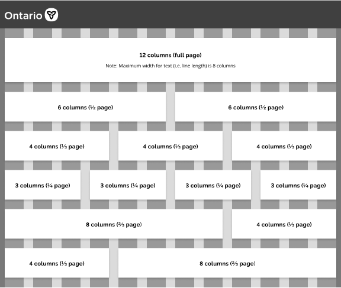

#### Dell Design System
Использует 12 колонок как базу, но с возможностью вложенности.
*   **База**: 8px grid.
*   **Особенность**: Четкие правила для вложенных сеток (Nested Grids).

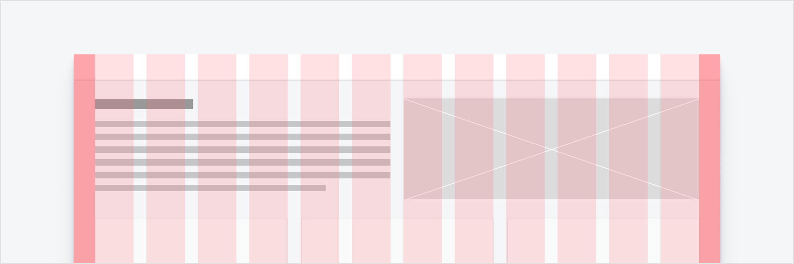

#### Другие системы с 12 колонками:
*   **US Web Design System (USWDS)**: Mobile-first.
*   **Fluent 2 (Microsoft)**: Адаптивная 12-колоночная сетка.
*   **Zendesk Garden**: Стандартная 12-колоночная сетка на Flexbox.
*   **Nord Health**: Гибкая 12-колоночная сетка.
*   **Helly Hansen**: Сетка для e-commerce, акцент на карточки товаров.
*   **PENCIL (zeroheight)**: Классический подход.

---

## 3. Концепция 2x Grid (Carbon Design)

Carbon Design System от IBM использует ритм 2x.

### Основные принципы
*   **Mini Unit**: 4px.
*   **Колонки**: До 16 колонок на широких экранах (X-Large, Max).
*   **Типы**: Fluid (резиновая) и Fixed (фиксированная).

| Breakpoint | Ширина (px) | Колонки | Gutter | Margin |
| :--- | :--- | :--- | :--- | :--- |
| **Small** | 320 | 4 | 32px | 0 |
| **Medium** | 672 | 8 | 32px | 16px |
| **Large** | 1056 | 16 | 32px | 16px |
| **Max** | 1584 | 16 | 32px | 24px |

---

## 4. Utility-First и CSS Grid подходы

Подходы, где сетка создается "на лету" или через CSS Grid свойства.

### Tailwind CSS / UAE Design System
*   **Принцип**: `grid-cols-X` + `gap-X`.
*   **Гибкость**: Можно создать 5, 7 или 11 колонок так же легко, как 12.
*   **Пример**: UAE Design System использует подход Tailwind, отказываясь от жестких "строк" (rows).

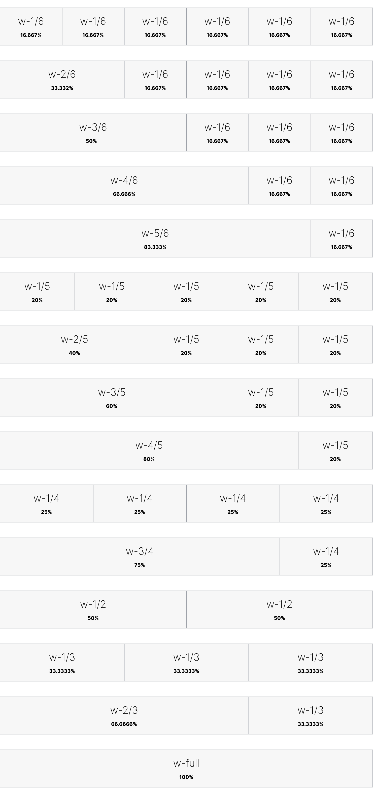

### Porsche Design System
*   **Технология**: Нативный CSS Grid.
*   **Особенность**: Сетка меняется от 6 колонок (мобайл) до 16 (широкий десктоп) + 2 "safe zone" колонки по бокам.
*   **Важно**: Porsche запрещает вкладывать сетки (nesting) на верхнем уровне.

---

## 5. Адаптивность и Breakpoints

### Apple Developer Documentation
Использует фиксированные брейкпоинты с изменением количества колонок.
*   Интересно, что Apple часто показывает примеры с меньшим количеством колонок (2, 3, 4) для контентных блоков.

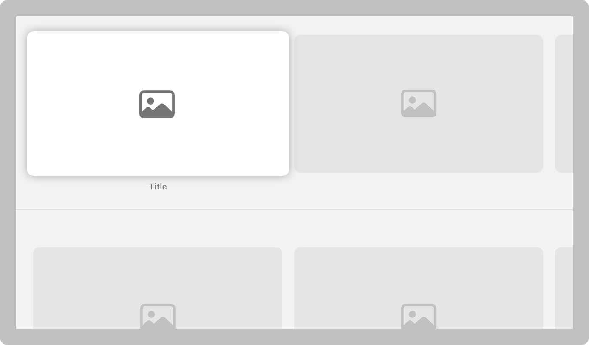
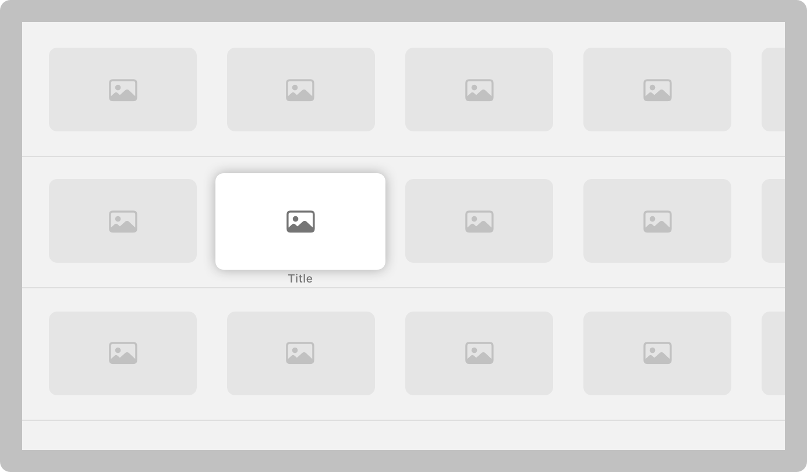

### Сравнение Breakpoints (Популярные значения)
*   **Mobile**: 320px - 480px (обычно 4 колонки).
*   **Tablet**: 600px - 900px (обычно 8 колонок).
*   **Desktop**: 1024px - 1440px (12 колонок).
*   **Wide**: 1440px+ (12 или 16 колонок).

---

## 6. Отступы (Gutters и Margins)

Правильная система отступов — это то, что отличает профессиональный интерфейс от любительского.

### Базовая сетка (Base Grid)
Большинство современных систем используют **4px** или **8px** как базовый множитель.
*   **4px**: Более гибкая, подходит для плотных интерфейсов (SaaS, дашборды). Позволяет делать отступы 4, 8, 12, 16, 20px.
*   **8px**: Стандарт де-факто. Обеспечивает чистый ритм (8, 16, 24, 32, 40px).

### Вертикальный ритм (Vertical Rhythm)
Сетка — это не только колонки (горизонталь), но и строки (вертикаль).
*   **Component Spacing**: Отступы внутри компонентов (padding) и между мелкими элементами (gap). Обычно 4px, 8px, 12px, 16px.
*   **Section Spacing**: Отступы между крупными логическими блоками. Обычно 24px, 32px, 48px, 64px.
*   **Content Density**: В SaaS продуктах часто нужны разные режимы плотности:
    *   *Compact*: База 4px (для таблиц, списков).
    *   *Comfortable*: База 8px (стандарт).
    *   *Spacious*: База 12px+ (для лендингов, онбординга).

### Material Design 3
*   **Gutters**: Адаптивные. 16px на мобильных, 24px на планшетах/десктопах.
*   **Margins**: Также адаптивные, обеспечивают "дыхание" макета.

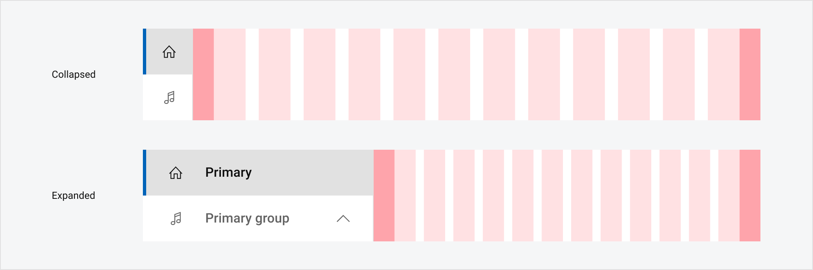

### Dell Design System (Fixed Gutters)
Отступы между колонками должны быть фиксированными для каждого брейкпоинта, чтобы сохранять визуальный ритм.

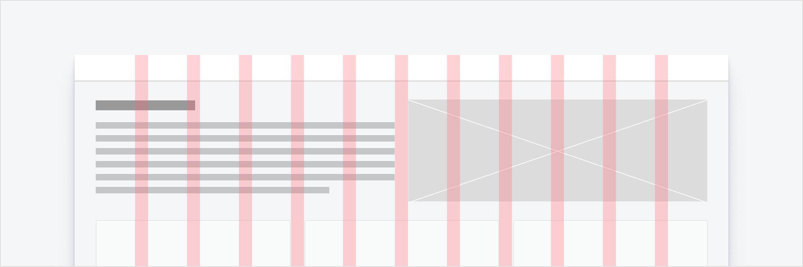

### Вертикальные отступы (Vertical Spacing)
Используйте базовую сетку (например, 4px) для вертикальных отступов, чтобы поддерживать ритм не только по горизонтали.

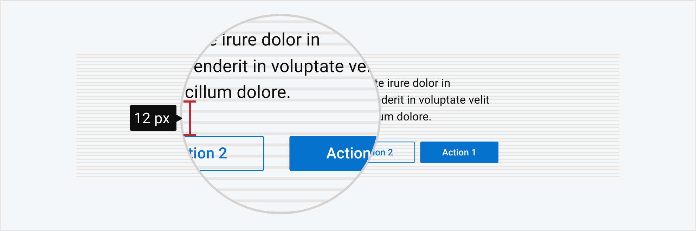

---

## 8. Layout паттерны для SaaS интерфейсов

SaaS приложения отличаются от обычных сайтов сложностью данных и необходимостью эффективного использования экранного пространства.

### App Shell (Каркас приложения)
Стандартная структура для большинства веб-приложений.
*   **Sidebar Navigation**: Левая панель (сворачиваемая или фиксированная). Обычно 240-280px.
*   **Top Bar**: Глобальный поиск, профиль, уведомления. Высота 48-64px.
*   **Main Content**: Рабочая область, занимающая всё оставшееся пространство.

### Dashboard Layout (Дашборд)
*   **Grid**: Часто используется CSS Grid для размещения виджетов разного размера.
*   **Masonry**: "Кирпичная" раскладка, если высота виджетов варьируется (реже используется в строгих SaaS).
*   **Пример**: *Datadog* использует плотную сетку для графиков, где каждый пиксель на счету.

### Data Tables (Таблицы данных)
Самый сложный паттерн в SaaS.
*   **Full Width**: Таблицы часто занимают 100% ширины контейнера.
*   **Sticky Header**: Заголовки колонок фиксируются при скролле.
*   **Horizontal Scroll**: Если колонок много, таблица скроллится внутри своего контейнера, не ломая общий лейаут страницы.

### Detail Pages (Страницы сущностей)
Например, профиль пользователя или карточка сделки в CRM.
*   **2-Column**: Основная информация слева (2/3), мета-данные и действия справа (1/3).
*   **3-Column**: Навигация по сущности (слева), контент (центр), контекстные действия (справа).
*   **Пример**: *Salesforce Lightning* и *GitLab* активно используют 3-колоночные макеты для сложных сущностей.

### Forms (Формы)
*   **Single Column**: Лучше всего для линейного заполнения (меньше когнитивная нагрузка).
*   **Multi-column**: Допустимо для плотных форм редактирования данных, но требует четкой группировки полей.

---

## 9. SaaS Layout Components

Специфические компоненты, которые формируют структуру SaaS интерфейса.

### Sidebar Navigation (Боковая навигация)
*   **Размеры**: Ширина обычно фиксирована (240px, 256px, 280px).
*   **Collapsed State**: В свернутом состоянии — 64px или 80px (только иконки).
*   **Поведение**: Sticky (фиксируется при скролле) и Scrollable (внутри себя, если пунктов много).

### Top Navigation Bar
*   **Высота**: 48px, 56px, 64px.
*   **Z-index**: Обычно самый высокий, чтобы перекрывать контент при скролле.

### Page Header & Breadcrumbs
*   **Расположение**: Верхняя часть Main Content Area.
*   **Состав**: Хлебные крошки, заголовок страницы (H1), основные действия (Primary Button).
*   **Отступы**: Часто отделяется от основного контента увеличенным отступом (32px+).
*   **GitHub Primer (Context Region)**:
    *   Используйте иерархию `:owner / :repository` для обозначения контекста.
    *   Не перегружайте эту область полным путем к файлу или кнопками действий.

### Action Bars (Панели действий)
*   **Контекстные действия**: Появляются при выборе элементов в таблице.
*   **Floating**: Иногда плавают внизу экрана или над таблицей.

### Modals & Drawers (Оверлеи)
*   **Modals (Dialogs)**: Для критических действий или коротких форм. Центрируются, имеют max-width (400px, 600px).
*   **Drawers (Slide-overs)**: Выезжают справа. Идеальны для детального просмотра или сложных форм настройки, не теряя контекста основной страницы. Ширина: 400px, 600px или % от экрана.

---

## 10. Режимы плотности контента (Density)

В профессиональных интерфейсах пользователи часто хотят видеть больше данных на одном экране.

### Compact (High Density)
*   **Для кого**: Аналитики, администраторы, опытные пользователи.
*   **Характеристики**:
    *   Base unit: 4px.
    *   Font size: 12px-13px.
    *   Input height: 24px-32px.
    *   Table row height: 32px-40px.

### Comfortable (Standard Density)
*   **Для кого**: Большинство пользователей, стандартные задачи.
*   **Характеристики**:
    *   Base unit: 8px.
    *   Font size: 14px-16px.
    *   Input height: 36px-40px.
    *   Table row height: 48px-56px.

### Spacious (Low Density)
*   **Для кого**: Новички, touch-интерфейсы, фокусировка на одной задаче.
*   **Характеристики**:
    *   Base unit: 8px-12px.
    *   Font size: 16px+.
    *   Input height: 48px+.
    *   Table row height: 64px+.

*Пример*: **Salesforce Lightning Design System** имеет переключатель плотности (Comfy / Compact), который глобально меняет отступы в списках и таблицах.

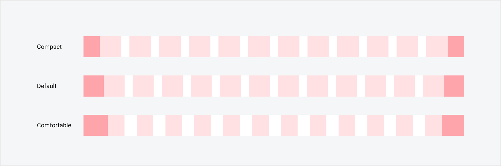

---

## 11. Accessibility в Layout системах

Layout напрямую влияет на доступность интерфейса.

### Порядок фокуса (Focus Order)
Визуальный порядок элементов должен совпадать с порядком в DOM.
*   **Проблема**: Использование `flex-direction: row-reverse` или `grid-auto-flow: dense` может визуально менять элементы местами, но скринридер будет читать их в исходном порядке.
*   **Решение**: Старайтесь сохранять естественный порядок в HTML.

### Reflow (Перестроение)
Согласно **WCAG 2.1 (1.4.10)**, контент должен быть доступен без горизонтальной прокрутки при масштабировании до **400%** (или на ширине 320px).
*   Это значит, что многоколоночные макеты должны превращаться в одноколоночные.
*   Исключение: Таблицы данных и карты (для них нужен скролл).

### Touch Targets
Даже в десктопных SaaS интерфейсах элементы не должны быть слишком мелкими (гибридные ноутбуки с тачскринами).
*   Минимальная зона клика: **44x44px** (WCAG AAA) или хотя бы **24x24px** с достаточными отступами.

### Landmarks
Используйте семантические теги для разметки основных зон сетки:
*   `<header>` (Top Bar)
*   `<nav>` (Sidebar)
*   `<main>` (Content Area)
*   `<aside>` (Secondary Panels)
*   `<footer>`

---

## 12. Производительность Layout

Сложные сетки могут влиять на производительность рендеринга.

### CSS Grid vs Flexbox
*   **CSS Grid**: Идеален для двумерных макетов (страницы целиком). Браузеры оптимизировали Grid, и он работает очень быстро.
*   **Flexbox**: Лучше для одномерных компонентов (кнопки в ряд, элементы навигации).
*   *Совет*: Не бойтесь смешивать. Grid для каркаса страницы, Flex для компонентов.

### Cumulative Layout Shift (CLS)
Метрика Google, оценивающая стабильность макета.
*   **Проблема**: Контент "прыгает" при загрузке (например, таблица сначала схлопнута, потом загрузились данные и она расширилась).
*   **Решение**: Всегда задавайте минимальную высоту (`min-height`) для контейнеров, пока данные грузятся (Skeleton Loaders).

### Virtual Scrolling (Виртуализация)
Для SaaS таблиц с 1000+ строк.
*   Рендерите в DOM только те строки, которые видны на экране.
*   Это критически важно для производительности лейаута.

### Container Queries
Новый стандарт (`@container`), позволяющий компонентам адаптироваться не к ширине экрана, а к ширине своего родителя.
*   Идеально для виджетов дашборда, которые могут быть и на всю ширину, и в 1/3 колонки.

---

## 13. Инструменты для работы с Layout

Полезные утилиты для дизайнеров и разработчиков.

### Браузерные расширения
*   **Gridman** (Chrome): Визуальный редактор CSS Grid прямо в браузере.
*   **Pesticide**: Подсвечивает границы всех элементов на странице (помогает увидеть структуру).
*   **VisBug**: Позволяет измерять расстояния и двигать элементы на живом сайте.

### Генераторы кода
*   **Layoutit!**: Интерактивный конструктор CSS Grid.
*   **CSS Grid Generator**: Простой инструмент для создания базовых сеток.

### Figma Плагины
*   **Grids Generator**: Быстрое создание сеток фреймов.
*   **Layout Grid Visualizer**: Помогает документировать настройки сетки для разработчиков.

---

## 14. Чеклист при создании Layout

Проверьте свой макет перед передачей в разработку.

*   [ ] **Breakpoints**: Определено поведение на 320, 768, 1024, 1440 и 1920px?
*   [ ] **Base Unit**: Все отступы и размеры кратны 4px или 8px?
*   [ ] **Max-width**: Текстовые блоки не растягиваются бесконечно?
*   [ ] **Scroll**: Нет горизонтального скролла на мобильных (кроме таблиц)?
*   [ ] **Sticky**: Зафиксированные элементы не перекрывают контент на маленьких экранах по высоте?
*   [ ] **Empty States**: Продумано, как выглядит лейаут, когда данных нет?
*   [ ] **Overflow**: Что будет, если заголовок будет в 3 строки?
*   [ ] **Accessibility**: Порядок фокуса логичен?

---

## 15. Примеры реализации

### CSS Grid (Базовый лейаут)
```css
.app-shell {
  display: grid;
  grid-template-areas:
    "header header"
    "sidebar main";
  grid-template-columns: 240px 1fr;
  grid-template-rows: 64px 1fr;
  height: 100vh;
}

@media (max-width: 768px) {
  .app-shell {
    grid-template-areas:
      "header"
      "main";
    grid-template-columns: 1fr;
    grid-template-rows: 56px 1fr;
  }
}
```

### Tailwind CSS (Card Grid)
```html
<div class="grid grid-cols-1 sm:grid-cols-2 lg:grid-cols-3 xl:grid-cols-4 gap-6">
  <!-- Cards go here -->
</div>
```

### React (Компонентный подход)
```jsx
const PageLayout = ({ children }) => (
  <Box display="grid" gridTemplateColumns="repeat(12, 1fr)" gap={4}>
    <Box gridColumn="span 12" lg="span 8">
      {/* Main Content */}
    </Box>
    <Box gridColumn="span 12" lg="span 4">
      {/* Sidebar / Widgets */}
    </Box>
  </Box>
);
```

---

## 16. Разделение экрана на зоны (Zoning)

Четкое зонирование помогает пользователю ориентироваться.

### Основные зоны
1.  **Global Navigation (Header)**: Ориентация "Где я в системе?".
2.  **Local Navigation (Sidebar)**: Ориентация "Что я могу здесь сделать?".
3.  **Context Header**: Заголовок текущей страницы + ключевые действия.
4.  **Content Area**: Сама работа.
5.  **Utility Area (Footer/Right Panel)**: Справка, чат поддержки, дополнительные настройки.

### Safe Areas
Не забывайте про системные отступы:
*   **Mobile**: Отступы под "челку" (notch) и домашнюю полоску (home indicator). Используйте `env(safe-area-inset-top)` и `env(safe-area-inset-bottom)`.
*   **Browser UI**: Учитывайте скроллбары (они могут съедать 15-17px ширины на Windows).

---

## 17. Продвинутые техники

### Nested Grids (Вложенные сетки)
Использование сетки внутри сетки.
*   **Правило**: Вложенная сетка должна выравниваться по колонкам родительской сетки.
*   **Исключение**: Компоненты-карточки могут иметь свою внутреннюю микро-сетку, независимую от глобальной.

### Full-bleed Sections
Секции, которые вырываются из контейнера на всю ширину экрана (например, цветной фон или баннер), но контент внутри них остается в рамках сетки.
*   Реализуется через `width: 100vw; margin-left: calc(50% - 50vw);` или CSS Grid.

### Sticky Elements
Фиксация заголовков таблиц или панелей действий.
*   **Важно**: Следите за `z-index` и контекстом наложения (stacking context), чтобы sticky элементы не перекрывали друг друга.

---

## 7. Каталог дизайн-систем

Полный список проанализированных систем и их ключевые особенности.

| Дизайн-система | Тип сетки | Особенности |
| :--- | :--- | :--- |
| **[Carbon Design System](https://carbondesignsystem.com/elements/2x-grid/overview/)** | 2x Grid (16 col) | Ритм 4px, 16 колонок на больших экранах |
| **[Ontario Design System](https://designsystem.ontario.ca/docs/basics/grid.html)** | 12-column | Строгая, фиксированные gutters 32px |
| **[Dell Design System](https://www.delldesignsystem.com/foundations/grid/)** | 12-column | База 8px, детальные правила вложенности |
| **[Material Design 3](https://m3.material.io/foundations/layout/understanding-layout)** | Responsive | Адаптивные gutters/margins, концепция "Layout regions" |
| **[Adobe Spectrum](https://spectrum.adobe.com/page/responsive-grid/)** | Responsive | Акцент на адаптивность под touch/mouse, запрет на выравнивание атомов |
| **[Tailwind CSS](https://tailwindcss.com/docs/aspect-ratio)** | Utility (CSS Grid) | Полная свобода, классы `grid-cols-*` |
| **[UAE Design System](https://designsystem.gov.ae/guidelines/layout)** | Utility (Tailwind) | На базе Tailwind, без жестких rows |
| **[USWDS](https://designsystem.digital.gov/utilities/layout-grid/)** | 12-column | Mobile-first, flexbox |
| **[Nord Health](https://nordhealth.design/grid/)** | 12-column | Поддержка Fixed и Fluid режимов |
| **[Porsche Design System](https://designsystem.porsche.com/v3/styles/grid)** | CSS Grid | До 16 колонок + safe zones, без вложенности |
| **[Apple Developer](https://developer.apple.com/design/human-interface-guidelines/layout)** | Fixed/Fluid | Акцент на читаемость, 2-4 колонки для контента |
| **[Fluent 2 (Microsoft)](https://fluent2.microsoft.design/layout)** | 12-column | Глубокая интеграция с платформой Windows/Web |
| **[Zendesk Garden](https://garden.zendesk.com/components/grid)** | 12-column | Flexbox, стандартная реализация |
| **[Samsung Developer](https://developer.samsung.com/one-ui/layout/basic.html)** | Responsive | Акцент на разные форм-факторы устройств |
| **[GE HealthCare (Ethos)](https://eds.gehealthcare.com/layout-panel?tab=0)** | Responsive | Специфика медицинских интерфейсов |
| **[New York State](https://designsystem.ny.gov/foundations/utilities/grid/)** | 12-column | Похожа на USWDS, строгие стандарты доступности |
| **[Helix](https://www.helixui.com/9904796d6/p/63a1f3-grid)** | 12-column | Стандартная сетка |
| **[Horizon](https://horizon.servicenow.com/foundations/grids-and-layouts)** | Responsive | Адаптивные лейауты |
| **[Helly Hansen](https://design.hellyhansen.com/1b4c2ca6d/p/08d071-grids-layout-20/b/80c303)** | 12-column | E-commerce специфика |
| **[Michelin](https://designsystem.michelin.com/tokens/grid-c)** | Responsive | Сложные корпоративные интерфейсы |
| **[Progettare (Italy)](https://www.inps.design/3e7e2b0f5/p/295f98-griglie/b/786f73)** | Responsive | Гос. стандарты Италии |
| **[Basis](https://design.basis.com/foundations/layout)** | Responsive | Финансовый сектор |
| **[Cloudscape (AWS)](https://cloudscape.design/foundation/visual-foundation/layout/)** | Fluid | Для сложных админок и дашбордов |
| **[Braid](https://seek-oss.github.io/braid-design-system/foundations/layout)** | Responsive | Модульная система |
| **[Base (Uber)](https://base.uber.com/6d2425e9f/p/785d5f-layout-grids)** | Responsive | Акцент на карты и мобильные интерфейсы |
| **[eBay Playbook](https://playbook.ebay.com/foundations/layout-in-product)** | Responsive | E-commerce, карточная система |
| **[Pajamas (GitLab)](https://design.gitlab.com/product-foundations/layout)** | Responsive | Для сложных технических интерфейсов |
| **[Primer (GitHub)](https://primer.style/design/foundations/layout)** | 12-column | Утилитарный подход, похож на Tailwind |
| **[Seeds (Sprout Social)](https://seeds.sproutsocial.com/patterns/layout)** | Responsive | Социальные медиа дашборды |
| **[Ahoy](https://ahoy.teamleader.design/3547946e7/p/26a2ef-layout/b/50bd29)** | Responsive | Маркетинговые лейауты |
| **[Lightning (Salesforce)](https://www.lightningdesignsystem.com/guidelines/layout/)** | Responsive | Плотные интерфейсы CRM |
| **[PENCIL (zeroheight)](https://design.brainly.com/8adfd5f36/p/122c11-layout)** | 12-column | Для документации (Brainly) |
| **[Radix Themes](https://www.radix-ui.com/themes/docs/overview/layout)** | Layout Components | Компонентный подход (`<Grid>`, `<Flex>`) |
| **[Morningstar](https://design.morningstar.com/systems/product/guidelines/grids)** | Responsive | Финансовые данные |
| **[NSW Digital (Australia)](https://designsystem.nsw.gov.au/core/layout/index.html)** | Responsive | Гос. стандарты Австралии |
| **[PatternFly (Red Hat)](https://www.patternfly.org/layouts/about)** | Responsive | Enterprise IT интерфейсы |
| **[Paste (Twilio)](https://paste.twilio.design/foundations/spacing-and-layout)** | Responsive | Компоненты для коммуникаций |
| **[Datadog (DRUIDS)](https://druids.datadoghq.com/foundations/spacing-and-layout)** | Responsive | Дашборды мониторинга |
| **[Flow (Skoda)](https://flow.skoda-brand.com/d/6aQMrmD6PhWL/web#/styles/layout)** | Responsive | Внутренние инструменты |
| **[Ant Design](https://ant.design/docs/spec/layout)** | Responsive | Популярная React UI библиотека |
| **[Biings](https://biings.design/#/layout)** | Responsive | Модульная система |
| **[Danish Design System](https://designsystem.dk/styleguide/layout/)** | Responsive | Гос. стандарты Дании |
| **[Watson (Docplanner)](https://watson.docplanner.design/components/layout)** | Responsive | Медицинские сервисы |
| **[Workbench (Gusto)](https://workbench.gusto.com/foundations/layout/)** | Responsive | HR и Payroll платформа |
| **[LINE Design System](https://designsystem.line.me/LDSG/foundation/layout-en/)** | Responsive | Мессенджер и сервисы |
| **[MongoDB](https://www.mongodb.design/foundations/grid)** | Responsive | Базы данных и инструменты |
| **[Tractie (NS)](https://tractie.ns.nl/2e23992f3/p/41f5d2-layout-for-web)** | Responsive | Железные дороги Нидерландов |
| **[Evergreen (Segment)](https://evergreen.segment.com/foundations/layers)** | Responsive | B2B SaaS |
| **[Polaris (Shopify)](https://polaris.shopify.com/design/layout)** | Responsive | E-commerce платформа |
| **[Vercel](https://vercel.com/design/grid)** | Responsive | Облачная платформа |

*(Примечание: "Responsive" в таблице означает адаптивную сетку, которая чаще всего базируется на 12 колонках, но имеет специфические правила поведения на разных экранах)*
